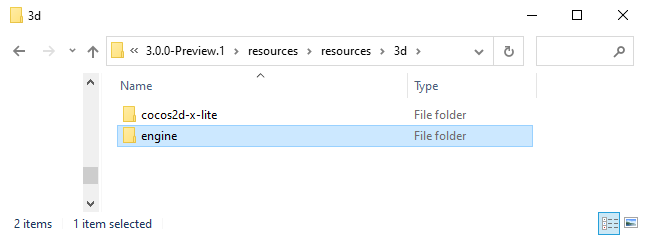
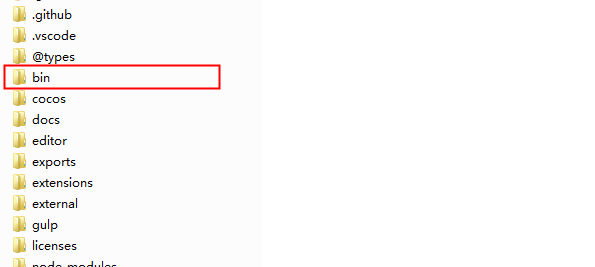

# Engine Customization Workflow

The game engine in Cocos Creator has two parts: JavaScript engine with ECS (entity-component system) and Cocos2d-x (custom version of Cocos2d-x). They are both open sourced on GitHub:

- [Creator-JS engine](https://github.com/cocos/cocos-engine)
- [Cocos2d-x engine](https://github.com/cocos/engine-native)

If you want to customize engine, we recommend that you follow the __fork workflow__ thru GitHub. Please read [GitHub help: Fork A Repo](https://help.github.com/articles/fork-a-repo) to learn the details.

## 1 Customize JavaScript Engine

If your concern is only Web based games, or what you want to change in the engine is not native API, related (for example UI and animation components), you just need to follow the workflow here:

### 1.1 Get JavaScript Engine Repository

If you only need to make some adjustments based on the current version, Then you can modify it based on the builtin engine of Cocos Creator. Click **Open App** in the upper right corner of the Creator Editor, and then copy the builtin **engine** directory to another local paths.



If you want to get the latest version that is currently under development, you need to first fork or clone the original version of the JavaScript engine from GitHub. You have to make sure the repo is at the corresponding branch. For example to customize engine for __Cocos Creator v1.6.2__ you'd need to checkout `v1.6` branch; for __Cocos Creator v1.7.1__ you'd need to checkout `v1.7` branch. Once cloning is completed, go to the repo's folder in command-line shell.


### 1.2 Install NPM Dependencies

__npm__ and __gulp__ are core components for engine building. These need to be installed. Example:

```bash
# Enter the engine path in the command line
cd /Users/yufang/engine
# Install the gulp build tool
npm install -g gulp
# Install dependent modules
npm install
```

### 1.3 Change and Build

Now you can do whatever you want to do with the engine, once you finished:

```bash
# build engine
gulp build
```

This command will generate a `bin` folder in the engine directory and compile the engine source into the `bin` directory.



### 1.4 Use customized engine in Cocos Creator

Use the **Custom Engine** tab of the `Project -> Project Settings` panel to set the path to your customized JavaScript engine.


## 2 Customized Cocos2d-x Engine

If you need to change stuff of rendering or native API related function. Besides updating JavaScript engine (so that your change can work with component system) you'll need to synchronize your change to the customized cocos2d-x engine of Cocos Creator.

### 2.1 Get the Cocos2d-x Engine

If you only need to make some adjustments based on the current version, Then you can modify it based on the builtin Cocos2d-x engine of Cocos Creator. Same as get JavaScript engine: click **Open App** in the upper right corner of the Creator Editor, and then copy the builtin **cocos2d-x** directory to another local paths.

If you want to get the latest version that is currently under development, you need to download it from the GitHub repo specified above. please make sure you get the cocos2d-x engine repo from the link on top of this article. Same as JavaScript engine, you need to make sure cocos2d-x repo is on correct branch. For Cocos Creator v1.6.2 please checkout `v1.6` branch.

### 2.2 Initialize

Once cloned, enter the Cocos2d-x engine folder and run:

```bash
# Enter the Cocos2d-x engine path from the command line
cd /Users/yufang/cocos2d-x
# Install NPM dependencies
npm install
# Initialize repo
gulp init
```

- If you get an error like the one below, please download the zip file manually. The reason for the error is that the version of a library that your python ships with is too low, but it is not very easy to upgrade. The simpler method is to download the zip file and manually put it under the Cocos2d-x engine repo and rename it to `v3-deps-54.zip` (you do not need to unzip the zip file.) and rerun `gulp init` again.

```bash
> ==> Ready to download 'v3-deps-54.zip' from
> 'https://github.com/cocos/cocos-engine-external/archive/v3-deps-54.zip'
> Traceback (most recent call last):
> ...
> URLError: <urlopen error [SSL: TLSV1_ALERT_PROTOCOL_VERSION] tlsv1 alert protocol version (_ssl.c:590)>
```

- If you get an error like the one below, please manually download the zip file. Manually put it in the Cocos2d-x engine repository under the `tools/cocos2d-console` directory and rename it to `creator-console-2.zip` (without unzipping the zip file), and rerun `gulp init` again.

```bash
> ==> Ready to download 'creator-console-2.zip' from
> 'https://github.com/cocos2d/console-binary/archive/creator-console-2.zip'
> Traceback (most recent call last):
> ...
> URLError: <urlopen error [SSL: TLSV1_ALERT_PROTOCOL_VERSION] tlsv1 alert protocol version (_ssl.c:590)>
```

### 2.3 Configure Custom Engine in Cocos Creator

Use the **Custom Engine** tab of the **Project -> Project Settings** panel to set the path to your customized cocos2d-x engine.


### 2.4 Build from Source

Next, you can start working on updating code for Cocos2d-x. If you want to use source code in your built project you can just choose `default` or `link` template in **Build** panel and compile from the source, no extra command line work needed.

### 2.5 Build binary library and simulator

- If you want to use a `binary` template to build and compile native project (it's much faster since Cocos2d-x code are already compiled), you'll need to run these commands:

    ```bash
    # use cocos console to generate prebuilt binary libs
    gulp gen-libs
    ```

- To generate simulator to preview your changes:

    ```bash
    # use cocos console to generate simulator
    gulp gen-simulator
    gulp update-simulator-config
    ```

**Attention**: If you need to debug your customized simulator on macOS, you must sign the Xcode project first. See [Build simulator](https://github.com/cocos/engine-native/blob/develop/README.md#git-user-attention) for details.


## 3 JSB Workflow (JavaScript Binding)

If your changes involves JavaScript and Cocos2d-x changes at the same time. You should read this article:

Creator >= 1.7, please refer to:

- [JSB 2.0 Binding Tutorial](jsb/JSB2.0-learning.md).

Creator <= 1.6, please refer to:

- [Script binding in Cocos [cn]](https://zhuanlan.zhihu.com/p/20525026)
- [Automatic binding in Cocos [cn]](https://zhuanlan.zhihu.com/p/20525109)
