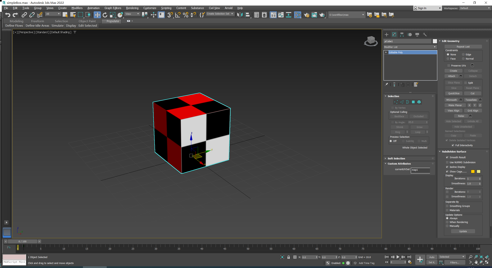
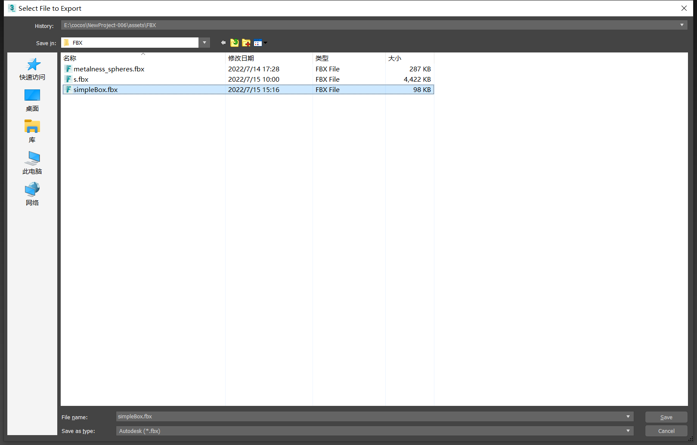
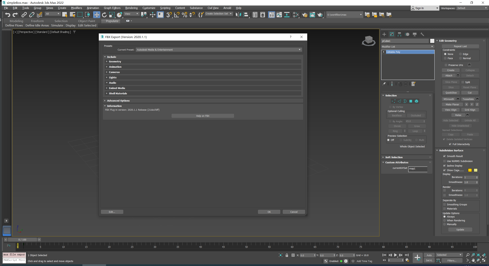

# Export FBX file from Max

## Steps

1. Select the model:

  

2. Go to **File -> Export -> Export Selected**:

  

3. Set **Save as type** to ***.fbx**, click the **save** button:

  
  
4. Set **Current Preset** to **Autodesk Media and Entertainment**:

  
  
5. Enable **Embed Media** check box:

  
  
6. Click **OK** to export the file:
  
  
  
**Remarks** : For more information, please refer to [Max Fbx Files](https://help.autodesk.com/view/3DSMAX/2022/ENU/?guid=GUID-26E80277-1645-4C4E-A6B2-44399376490F)

## Import fbx into your project

1. Place the export file **simpleBox** in the **Asset** folder of your project directory. More info about [FBX Import](mesh.md).
2. Comparison of import results.

| 3ds Max Viewport                                                            | Cocos Creator Scene Viewport                                                  |
|-----------------------------------------------------------------------------|-------------------------------------------------------------------------------|
|  |  |
