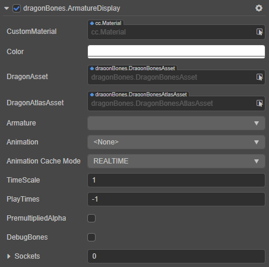
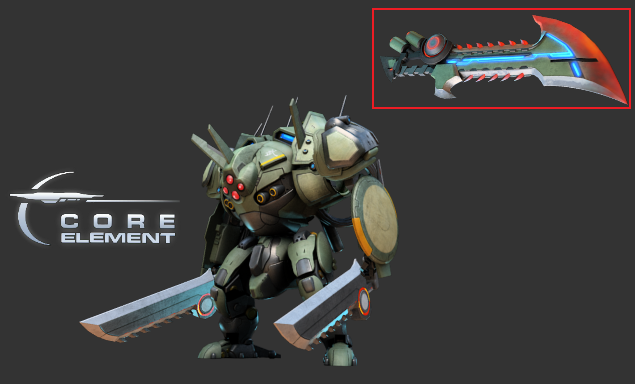
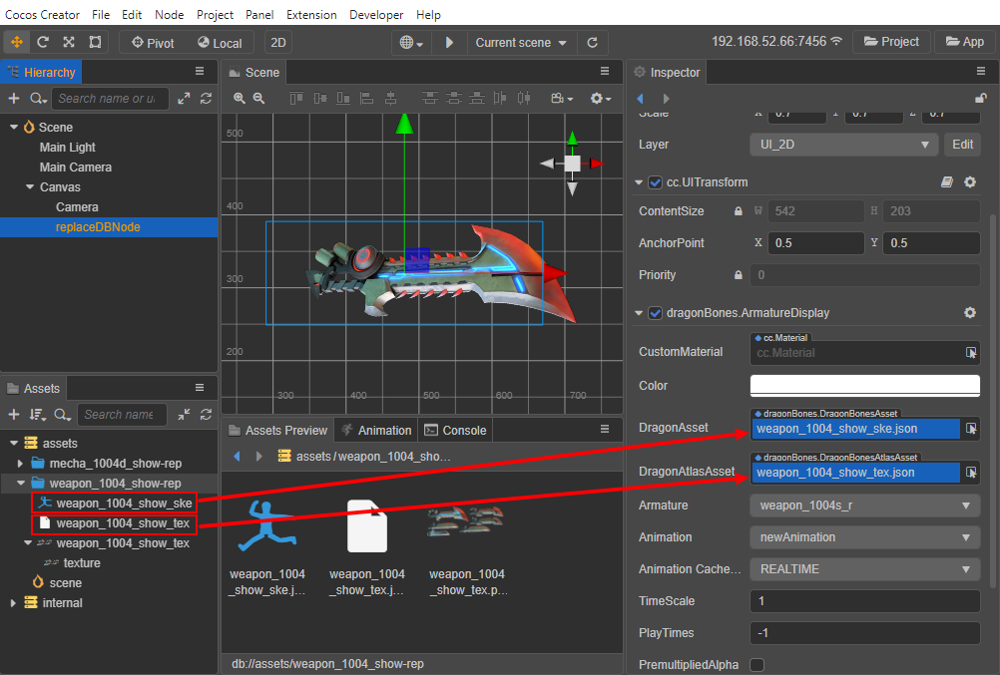
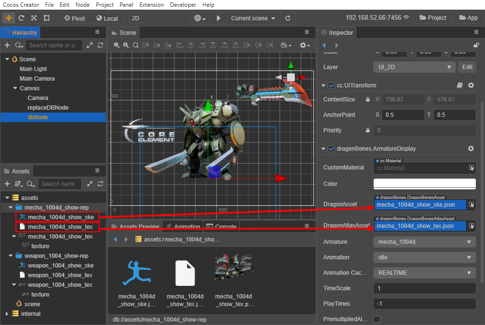
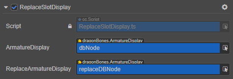
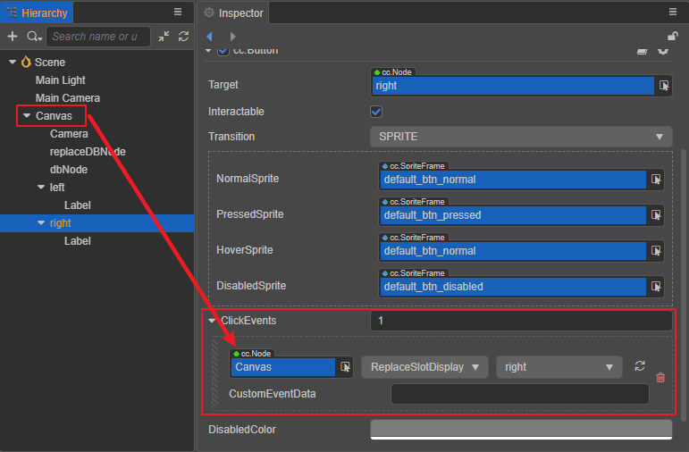
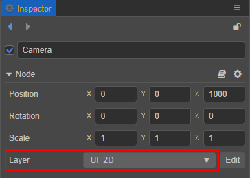

# DragonBones ArmatureDisplay Component References

The ArmatureDisplay component can render and play DragonBones assets.



In the **Hierarchy** panel, select the node where you want to add the ArmatureDisplay component, and then click the **Add Components -> DragonBones -> ArmatureDisplay** button under the **Inspector** panel to add the ArmatureDisplay component to the node.

- For information on using the ArmatureDisplay component, please refer to the [DragonBones example case](https://github.com/cocos/cocos-test-projects/tree/v3.3/assets/cases/dragonbones) for details.
- For DragonBones ArmatureDisplay related scripting interfaces, please refer to the [ArmatureDisplay API](__APIDOC__/en/#/docs/3.3/en/dragonBones/Class/ArmatureDisplay) for details.

## DragonBones Properties

| Property | Description
| :-------- | :---------- |
| CustomMaterial        | Custom materials that can be used to achieve rendering effects such as dissolve, external glow, etc. Please refer to the [Custom Materials](../../ui-system/components/engine/ui-material.md) documentation for details.
| Color                | Set the skeleton animation color.
| DragonAsset          | Skeletal information data that contains skeletal information (bound skeletal actions, slots, render order, attachments, skins, etc.) and animations, but does not hold any state. <br>Multiple ArmatureDisplays can share the same skeletal data. <br/>Skeletal assets exported by DragonBones can be dragged and dropped here.
| DragonAtlasAsset    | The Atlas Texture data needed for the skeleton data. Drag and drop DragonBones exported Atlas assets here.
| Armature              | The name of the Armature currently in use
| Animation             | Name of the currently playing animation
| Animation Cache Mode  | Rendering modes, including **REALTIME** (default setting), **SHARED_CACHE** and **PRIVATE_CACHE**. <br>1. **REALTIME** mode, real-time computing, supports all DragonBones features. <br>2. **SHARED_CACHE** mode, caches and shares skeletal animations and texture data, equivalent to pre-baked skeletal animations. **SHARED_CACHE** mode has higher performance, but does not support action fusion, action overlay, skeleton nesting, and only supports action start and end events. As for memory, it has a memory advantage when creating N (N>=3) animations with the same skeleton and the same action, the larger the N value, the more obvious the advantage. In summary, **SHARED_CACHE** mode is suitable for scene animations, effects, replica monsters, NPCs, etc., and can greatly improve frame rates and reduce memory consumption. <br>3. **PRIVATE_CACHE** mode, similar to **SHARED_CACHE** but does not share animation and texture data, so there is no memory advantage, only performance advantage. Use **PRIVATE_CACHE** to take advantage of the high performance of the cache mode and to also implement texture replacement (which cannot share the texture data).
| TimeScale            | The time scale of all animations in the current skeleton. The default value is **1**, which means no scaling.
| PlayTimes            | The number of cycles to play the default animation.<br>**-1** means use the default value from the DragonBones resource file.<br>**0** means infinite loop.<br>**>0** means loop times.
| PremultipliedAlpha    | Whether the image is enabled for texture pre-multiplied, default is True.<br>This item needs to be turned off when the transparent area of the image appears color blocked. <br>Enabled when the translucent areas of the image become black.
| DebugBones            | Whether to show debug information for bone
| Sockets               | Used to attach certain external nodes to the specified skeleton joints. The value of the property indicates the number of attachment points. For details, please refer to the description below.

> **Notes**:
> 1. The **Anchor** and **Size** properties on the Node component in the **Inspector** panel are disabled when using the ArmatureDisplay component.
> 2. The ArmatureDisplay component is a UI renderable component, and the `Canvas` node is the rendering root for UI rendering, so the node with this component must be a child of the `Canvas` node (or a node with a `RenderRoot2D` component) to be displayed properly in the scene.

## DragonBones ReplaceTexture

The following is an example of how DragonBones replaces the texture. Replace the weapon in the left or right hand of the robot below with the weapon in the red box by replacing the slot's display object.



1. First create a new `Canvas` node in the **Hierarchy** panel, and then create a new empty node and name it to `replaceDBNode` under the `Canvas` node. Select `replaceDBNode` and add the **ArmatureDisplay** component to the **Inspector** panel. Drag and drop the weapon resource in the green box to the property boxes of the **ArmatureDisplay** component, as shown below:

    

2. Create a new empty node again and name it to `dbNode`. Then add the **ArmatureDisplay** component to the **Inspector** panel and drag the robot's assets to the property boxes of the **ArmatureDisplay** component, as shown below. Change the `Animation` property of the **ArmatureDisplay** component to set the animation you want to play.

    

3. Create a new TypeScript script and name it `ReplaceSlotDisplay` in the **Assets** panel to write the component script. The script code is as follows:

    ```ts
    import { _decorator, Component, dragonBones } from 'cc';
    const { ccclass, property } = _decorator;

    @ccclass('ReplaceSlotDisplay')
    export class ReplaceSlotDisplay extends Component {

        @property({ type: dragonBones.ArmatureDisplay })
        armatureDisplay: dragonBones.ArmatureDisplay | null = null
        @property({ type: dragonBones.ArmatureDisplay })
        replaceArmatureDisplay: dragonBones.ArmatureDisplay | null = null;

        _leftWeaponIndex = 0;
        _rightDisplayIndex = 0;
        _rightDisplayNames:string[] = [];
        _rightDisplayOffset:{x: number, y: number}[] = [];

        start () {
            this.replaceArmatureDisplay!.node.active = false;
            this._leftWeaponIndex = 0;
            this._rightDisplayIndex = 0;
            this._rightDisplayNames = ["weapon_1004s_r", "weapon_1004e_r"];
            this._rightDisplayOffset = [{ x: 0, y: 0 }, { x: -60, y: 100 }];
        }

        left () {
            let armature = this.armatureDisplay!.armature();
            let slot = armature!.getSlot("weapon_hand_l");
            slot!.displayIndex = slot!.displayIndex == 0 ? 4 : 0;
        }

        right () {
            this._rightDisplayIndex++;
            this._rightDisplayIndex %= this._rightDisplayNames.length;
            let armature = this.armatureDisplay!.armature();
            let slot = armature!.getSlot("weapon_hand_r");
            let replaceArmatureName = this.replaceArmatureDisplay!.armatureName;
            const displayName = this._rightDisplayNames[this._rightDisplayIndex];
            let factory = dragonBones.CCFactory.getInstance() as any;
            factory.replaceSlotDisplay(this.replaceArmatureDisplay!.getArmatureKey(), replaceArmatureName , "weapon_r", displayName, slot);

            let offset = this._rightDisplayOffset[this._rightDisplayIndex];
            slot!.parent.offset.x = offset.x;
            slot!.parent.offset.y = offset.y;
            armature!.invalidUpdate();
        }
    }
    ```

4. Next, attach the script component to the `Canvas` node, i.e. drag and drop the script into the **Inspector** panel of the `Canvas` node. Drag and drop the `dbNode` node and `replaceDBNode` node from the **Hierarchy** panel into the corresponding property boxes of the script component and save the scene.

    

5. Next, use the Button component's click event to trigger the `left` and `right` callback in the `ReplaceSlotDisplay` script to replace the texture by clicking the button.

    Create two new Button nodes under the `Canvas` node in the **Assets** panel and name them `left` and `right`. Adjust their position, size, text display and other properties as needed.

    Set the click events for the `left` and `right` nodes in the **Inspector** panel, drag the `Canvas` node with the `ReplaceSlotDisplay` script component attached to the `cc.Node` property box of the `ClickEvents` property of the `left` and `right` nodes respectively, specify script component as `ReplaceSlotDisplay`, and set the callback to `left`/`right` (the following figure shows the `right` node as an example).

    

6. After saving the scene, click the **Preview** button at the top of the editor, and click the **Left**/**Right** button to see that the robot's left/right hand weapons have been replaced. For details, please refer to the [ReplaceSlotDisplay](https://github.com/cocos/cocos-test-projects/tree/v3.3/assets/cases/dragonbones) example.

    

    > **Notes**:
    > 1. After the example is run, the weapon style replaced by the right hand is not consistent with the weapon style prepared in the Scene, which is caused by the resource problem, please refer to the specific code implementation.
    > 2. If the scene is not displayed when previewing, check that the `Layer` property of each node is consistent with that of the `Camera` node.
    >
    > 

## DragonBones Attachment and Collision Detection

DragonBones attachment and collision detection are done in exactly the same way as Spine, please refer to the [Spine Attachment and Collision Detection](./spine.md) documentation.
