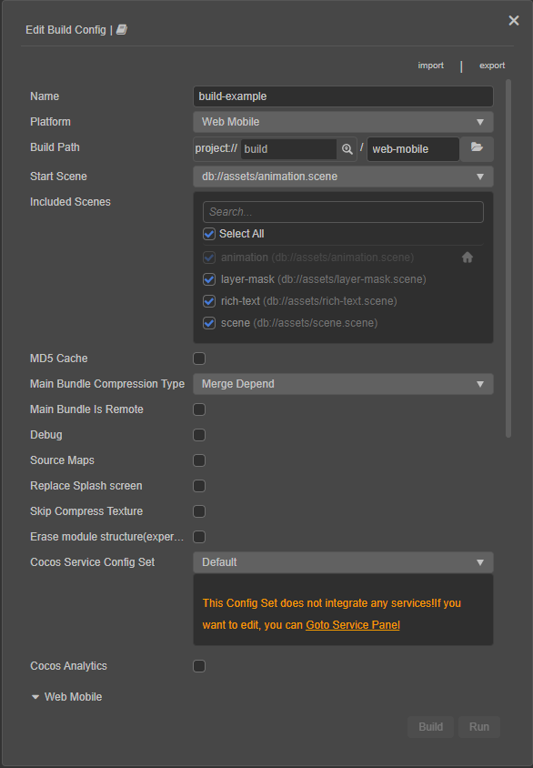
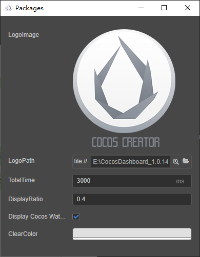

# Build Options

## General Build Options

For the general build options in the **Build** panel are as follows:



### Build Path

The Build Path contains two input boxes:


- The first input box is used to specify the build path of the project. The path can be entered directly in the input box or selected via the magnifying glass button next to it. Starting from v3.1, support to switch the following two paths to use:

    

    - **file**: The specified build path is an **absolute path**, which is the way used in previous versions.
    - **project**: The specified build path is a **relative path**, and the selected path can only be in the project directory. When using this path, some path-related configurations (e.g. Icon) in the build options are recorded as relative paths, making it easier for team members to share configurations across devices.

    The default build path is the `build` folder in the project directory. If a version control system such as Git or SVN is used, the `build` folder can be ignored in version control.

    > **Note**: Spaces, illegal characters and Chinese are not allowed in the Build Path.

- The second input box is used to specify the name of the build task when the project is built and the name of the release package generated after the build. The default is the name of the current build platform, and for each additional build of the same platform, the **-001** suffix will be added to the original one, and so on.

After the build is completed, click the folder icon behind the input box to open the project release package directory.

### Included Scenes

There are usually multiple game scenes in the project, this option allows you to choose the scenes you want to package. During the build process, all assets that depended on these selected scene assets in deep will be packaged. Just select the game scenes that are actually needed can reduce the size of game package after build.

### Start Scene

The first scene after entering the game can be set directly in the **Start Scene**. You can also choose other scenes, that are part of your game, in **Included Scenes**. Move the mouse to the scene, a `move up icon` button will appear after the scene, then click the button to set it.


### MD5 Cache

Append MD5 hash to the exported assets for resolving CDN or browser cache issue.

After being enabled, if any asset fails to load, it is because the renamed new file can not be found. It is usually because some third-party assets were not loaded by `assetManager`. If this happens, you can convert the url before loading, to fix the loading problem. Example:

```typescript
const uuid = assetManager.utils.getUuidFromURL(url);
url = assetManager.utils.getUrlWithUuid(uuid);
```

> **Note**: when **MD5 Cache** is enabled on the **native platform**, if any asset fails to load, it is usually because some third-party assets used in C++ were not loaded by `assetManager`. This can also be solved by converting the URL with the following code:
>
> ```cpp
> auto cx = ScriptingCore::getInstance()->getGlobalContext();
> JS::RootedValue returnParam(cx);
> ScriptingCore::getInstance()->evalString("cc.assetManager.utils.getUrlWithUuid(cc.assetManager.utils.getUuidFromURL('url'))", &returnParam);
>
> string url;
> jsval_to_string(cx, returnParam, &url);
> ```

### Main Bundle Compression Type

Set the compression type of the main package, please refer to the [Asset Bundle -- Compression Type](../../asset/bundle.md#compression-type) documentation for details.

### Main Bundle Is Remote

This option is optional and needs to be used with the **Resource Server Address** option.

If set, the main package is configured as a remote package, and along with its related dependent resources are built into a built-in Asset Bundle — [main](../../asset/bundle.md#the-built-in-asset-bundle) under the `remote` folder of the release package directory. You need to upload the entire `remote` folder to the remote server.

### Resource Server Address

This option is optional and used to fill in the address of the remote server where the resources are stored.

- If this option is left blank, the `remote` folder in the release package directory will be packaged into the built game package.
- If this option is filled in, the `remote` folder will not be packaged into the built game package. You need to manually upload the `remote` folder to the filled in resource server address after build.

### Debug

If this option is not checked, release mode will be built and the editor will compress and obfuscate the UUID of the asset, the engine script and project script generated by the build, and subpackage the `json` of the same type asset, reducing the times of asset loading.

If this option is checked, debug mode will be built, allowing you to debug the project and easily locate problems.

### Source Maps

The build will compress engine files and project scripts by default, if you want to generate a `sourcemap`, you need to check this box.

A `source map` is a file that maps from the transformed source to the original source, enabling the browser to reconstruct the original source and present the reconstructed original in the debugger.

For more details on `source maps`, please refer to the [Use a source map](https://developer.mozilla.org/en-US/docs/Tools/Debugger/How_to/Use_a_source_map) documentation.

### Replace Splash Screen

Mouse over this option and an **Edit icon** button will appear. Click this button and the panel will open. The first time you use this feature you need to fill out a questionnaire before opening the **Replace Splash Screen** panel. There will be some project-based information in the questionnaire, and we hope to gather more information on games developed using **Cocos Creator**, as well as more support programs in the future that developers will hopefully be able to fill out truthfully.



### Earse module structure (experimental)

If this option is checked, importing scripts will be faster, but you will not be able to use module characteristics, such as `import.meta`, `import()`, etc.

<!--
### 内联所有 SpriteFrame
自动合并资源时，将所有 SpriteFrame 与被依赖的资源合并到同一个包中。建议网页平台开启，启用后会略微增大总包体，多消耗一点点网络流量，但是能显著减少网络请求数量。建议原生平台关闭，因为会增大热更新时的体积。

### Merge all JSON that the Start Scene depends on

When merging assets automatically, all `JSON` files that the **Start Scene** depends on are merged into the package that contains the **Start Scene**. This option is disabled by default. When enabled, it will not increase the overall game size, but if these `JSON` is also used by other scenes, then CPU overhead may increase slightly when they are loaded again.
-->

### Cocos Service Config Set

This option is used to display all the services integrated in the [Service](https://service.cocos.com/document/en/) panel for the current project.

### Cocos Analytics

If this option is checked, the [Cocos Analytics](https://n-analytics.cocos.com/docs/en/) service in the [Service](https://service.cocos.com/document/en/) panel can be enabled directly.

## Build options related to each platform

Currently, due to the adjustment of the build mechanism, the processing of different platforms are injected into the **Build** panel as **plugins**. After you select the platform you want to build in the **Platform** of the **Build** panel, you will see the expanded options for the corresponding platform, and the name of the expanded options is the platform plugin name. You can see each platform plugin in **Extension -> Extension Manager -> Internal** of the main menu of the editor.

Custom build plugins are handled in the same way as platform plugins, see [Extend the Build Process](custom-build-plugin.md) for details.

## Configuration of other parameters involved in the build

The configuration in the editor menu bar **Project -> Project Settings** will affect the result of the project build, please refer to [Project Settings](../project/index.md) for details.
