# Cocos Creator 3.0 Upgrade Guide

## Version Introduction

__Cocos Creator 3.0__ integrates all the functions of the original __2D__ and __3D__ products, brings many major updates, and will become the main version of __Cocos Creator__. At the same time, 3.0 also continues __Cocos's__ advantages of light weight and high efficiency in 2D categories, and provides an efficient development experience for 3D heavy games.

In order to ensure the smooth transition of an existing __Cocos Creator 2.4__ project, Cocos Creator 2.4 will be used as the LTS (long-term support) version and provide continuous updates for the next __two years__! In __2021__, v2.4 will continue to be updated to provide bug fixes and new mini-game platform support to ensure the successful launch of your project; in __2022__, we will continue to provide developers with the key to v2.4 bug fixes to ensure the smooth operation of online games! Therefore:

- __Existing 2.x projects can continue to develop without compulsory upgrade to 3.0__.

- __For new projects, it is recommended to use version 3.0 for development__. We will continue to optimize the development experience and operating efficiency of 3.0 to support the smooth launch of heavy games of different categories such as 2D and 3D.

__Cocos Creator 3.0__ uses a new future-oriented engine architecture, which will bring high-performance, data-oriented and load-balanced renderers to the engine, and seamlessly support Vulkan & Metal multi-backend rendering. In the future, it will also support mobile VR/AR and some Host platform.

For a detailed introduction to the __Cocos Creator 3.0__, please visit the [Official Website Update Instructions](https://cocos.com/creator).

## How to migrate Cocos Creator 2.x projects

Although __it is not recommended to force projects in development, especially those about to go live, to upgrade to v3.0__, a v2.x resource import tool has been introduced in Cocos Creator 3.0. This tool supports the perfect import of resources from old projects, as well as assistance in migrating code.

### Resource Import

Developers only need to click __File -> Import Cocos Creator 2.x project__ in the main menu.

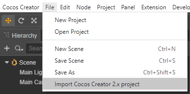

Next, select the root directory of the v2.x project in the file browse dialog that pops up.

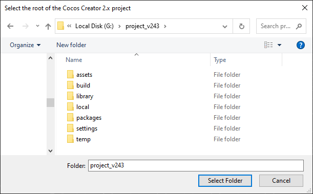

> __Note__: it is recommended to upgrade to v2.4.3 or above before importing to v3.0 for older projects, otherwise the correctness of the import result cannot be ensured.

All the resources in the v2.x project will be automatically presented in the popup __Import Cocos Creator 2.x Project__ panel. Developers can reconfirm the resources to be imported and then click the __Import__ button in the bottom right corner of the panel to complete the import. If the developer wants to switch the imported 2.x project, click the search icon button in the image below to reselect the project.

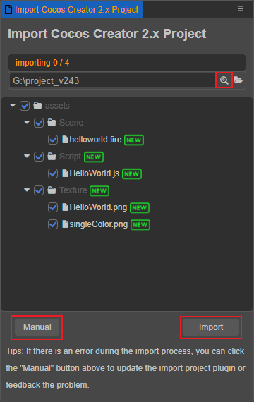

The __Manual__ button in the bottom left corner of the panel will take you to the GitHub repository for the Import Plugin, which can be used to [update the Import Plugin](https://github.com/cocos-creator/plugin-import-2.x/blob/main/README.md) or submit feedback.

### Code Migration

When importing a v2.x project developed in JavaScript, the code assisted migration feature of the import plugin will first convert the JavaScript to TypeScript and then perform the code migration.

For example, the imported v2.x project JavaScript code would look like this:

```typescript
// AudioController.js
cc.Class({
    extends: cc,

    properties: {
        audioSource: {
            type: cc.AudioSource,
            default: null
        },
    },

    play: function () {
        this.audioSource.play();
    },

    pause: function () {
        this.audioSource.pause();
    },

});
```

Due to the differences in how the code is written in each project and the different levels of complexity, the current import plugin only adds __component type declarations__, __property declarations__ and __function declarations__ to the code migration, the references to the components in the scene are __preserved__ and the code inside the function is migrated as __comments__. <br>
In addition, the original code of v2.x is kept intact as a comment at the end of the migrated code, so that developers can refer to it when converting manually.

The example code above, after the code assisted migration by the import plugin, looks like this:

```typescript
// AudioController.ts

import { _decorator, Component, AudioSource } from 'cc';
const { ccclass, property } = _decorator;

@ccclass('AudioController')
export class AudioController extends Component {
    @property
    public audioSource:AudioSource = 'null';

    play () {
        //this.audioSource.play();
    }

    pause () {
        //this.audioSource.pause();
    }

}


/**
 * Note: The original script has been commented out, due to the large changes in the script, there may be missing in the conversion, you need to manually convert it yourself
 */
// cc.Class({
//     extends: cc.Component,
// 
//     properties: {
//         audioSource: {
//             type: cc.AudioSource,
//             default: null
//         },
//     },
// 
//     play: function () {
//         this.audioSource.play();
//     },
// 
//     pause: function () {
//         this.audioSource.pause();
//     },
// 
// });
```

> __Notes__
>
> 1. When converting from JavaScript to TypeScript, it is necessary to declare __all properties__ in TypeScript and set the default values.
> 2. If the __Inspector__ panel data is missing, check if the property type is the same as v2.x.
> 3. If the JavaScript code uses external types, TypeScript prompts: Fix by importing external source files or declarations.

## Quick start for developers of older versions

### Material Upgrade

In v3.0, there are continued improvements to the design of the material system and the built-in Shader API. When upgrading from v2.x to v3.x, some of the content cannot be upgraded automatically and needs to be adjusted manually by the developer. For details, please refer to the [Material Upgrade Guide](../material-system/effect-2.x-to-3.0.md) documentation.

### Engine API Upgrade

- The UI-related interface changes on the node are as follows:

    - The interfaces related to coordinate transformation calculation (e.g.: `size` or `anchor`) are as follows:

        Please get the `UITransform` component on the node first, and then use the corresponding interface, for example:

        ```typescript
        const uiTrans = node.getComponent(UITransform)!;
        uiTrans.anchorX = 0.5;
        uiTrans.setContentSize(size);
        ```

    - The remaining interfaces are as follows:

        - `color`: needs to get the renderable component on the node first (e.g.: `Sprite` component), and then use the corresponding interface.

        - `opacity`: If there is a renderable component on the node, set the `color` of the renderable component directly. If there is no renderable component, you can set the renderable component's `color` by adding the `UIOpacity` component and setting the related property.

        - `skew`: The interface has been removed.

        - `group`: change to `layer`.

        - `zIndex`: change to [priority](__APIDOC__/en/#/docs/3.3/en/ui/Class/UITransform) of `UITransform`.

            > **Note**: the `priority` property is deprecated as of v3.1, please use the `setSiblingIndex` function to adjust the order of the node tree.

- `CCSpriteFrame`:

    - Remove the interfaces: `copyWithZone`, `copy`, `clone` and `ensureLoadTexture`.

    - Change the interface:

    `setFlipX` and `isFlipX` -> `flipUVX`

    `setFlipY` and `isFlipY` -> `flipUVY`

    `getTexture` and `setTexture` -> `texture` (where the type is Texture2D/ RenderTexture).

    - The remaining methods corresponding to `get` and `set` (e.g.: `getOffset`) all correspond directly to properties of the same name (e.g.: `offset`) in 3.0.

- `CCTexture2D`:

    - Change the interface: `genMipmaps` -> `mipmaps`, `initWithElement` -> `image`.

    - `initWithData`, the whole method is removed, similarly the use is to pass the original `ArrayBufferView` data to the new `ImageAsset`, and then `ImageAsset` to the new `Texture2D` to get a copy of the image resource.

- `Action`: Remove all related.

- __Physics__:

    - 2D changed components: `cc.Collider` -> `Collider2D`, `cc.BoxCollider` -> `BoxCollider2D`, `cc.RigidBody` -> `RigidBody2D`, etc.

    - 3D changed components: `cc.Collider3D` -> `Collider`, `cc.BoxCollider3D` -> `BoxCollider`, `cc.RigidBody3D` -> `RigidBody`, etc.

- __tween__:

    - Change the interface: `cc.repeatForever` -> `Tween.repeatForever`, `cc.reverseTime` -> `Tween.reverseTime`, `cc.show` ->  `Tween.show`, etc.

- __Animation__:

    - Change the interface: `addClip`-> `createState`, `getClips`-> `clips`, `playAdditive`-> `crossFade`, `getAnimationState`-> `getState`, etc.

- __Camera__:

    - Remove the interfaces: `findCamera`, `alignWithScreen`, `main`, `cameras`, `zoomRatio` and `containsNode`.

    - Change the interface: `backgroundColor` -> `clearColor`, `cullingMask` -> `visibility`, `depth`->`clearDepth`, `getScreenToWorldPoint`->`screenToWorld`, `getWorldToScreenPoint`->`worldToScreen`, `getRay`->`screenPointToRay`, etc.

- __Audio__:

    - Change the interface: `getLoop` and `setLoop` -> `loop`, `getVolume` and `setVolume` -> `volume`, `getCurrentTime` and `setCurrentTime` -> `currentTime`, `src` -> `clip`.

- __Materials__:

    - All relevant changes need to be done by getting a __Material instance__ on __MeshRenderer__ or its subclasses.

    - Remove the interfaces: `setBlend`, `setDepth`, `setStencilEnabled`, `setStencil` and `setCullMode` and call `overridePipelineStates` to complete the update. `define` calls `recompileShaders` to complete the update.

- The platform variable changes under __sys__ are as follows:

| Cocos Creator 2.x | Cocos Creator 3.0     |
|:----------------- |:--------------------- |
| `BAIDU_GAME`      | `BAIDU_MINI_GAME`     |
| `VIVO_GAME`       | `VIVO_MINI_GAME`      |
| `OPPO_GAME`       | `OPPO_MINI_GAME`      |
| `HUAWEI_GAME`     | `HUAWEI_QUICK_GAME`   |
| `XIAOMI_GAME`     | `XIAOMI_QUICK_GAME`   |
| `JKW_GAME`        | `COCOSPLAY`           |
| `ALIPAY_GAME`     | `ALIPAY_MINI_GAME`    |
| `BYTEDANCE_GAME`  | `BYTEDANCE_MINI_GAME` |

- The __global variables__ are changed as follows:

| Cocos Creator 2.x | Cocos Creator 3.0 |
|:----------------- |:----------------- |
| `CC_BUILD`        | `BUILD`           |
| `CC_TEST`         | `TEST`            |
| `CC_EDITOR`       | `EDITOR`          |
| `CC_PREVIEW`      | `PREVIEW`         |
| `CC_DEV`          | `DEV`             |
| `CC_DEBUG`        | `DEBUG`           |
| `CC_JSB`          | `JSB`             |
| `CC_WECHATGAME`   | `WECHATGAME`      |
| `CC_RUNTIME`      | `RUNTIME_BASED`   |
| `CC_SUPPORT_JIT`  | `SUPPORT_JIT`     |

- __Dynamic Loading__:

    When using `bundle.load` or `resources.load` to dynamically load a `sprite-frame` or `texture` in v3.0, the path needs to be specified to a specific sub-asset:

    ```ts
    // Load texture

    // v2.x
    resources.load('background', cc.Texture2D, () => {});
    // v3.0
    resources.load('background/texture', Texture2D, () => {});
    ```

    ```ts
    // Load sprite frame

    // v2.x
    resources.load('background', cc.SpriteFrame, () => {});
    // v3.0
    resources.load('background/spriteFrame', SpriteFrame, () => {});
    ```

### Editor upgrade

#### Build Panel

The builds of all platforms in __v3.0__ are built-in plug-ins, so the __Build__ panel is also different from __v2.4__. The unique build options of each platform will be placed in a foldable section control separately.

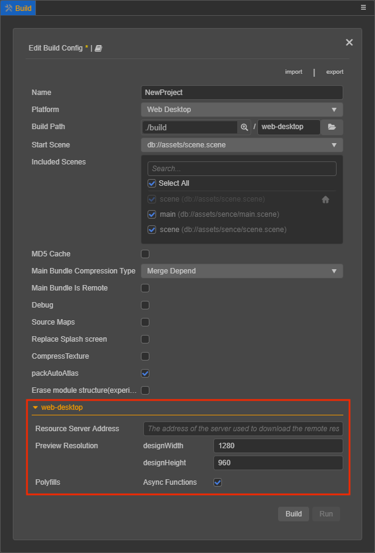

After clicking the build button, it will jump to the __Build Tasks__ panel, where all built platforms will be displayed. You can modify the build options of the built project in this panel and then rebuild, view the build log, open the project directory, etc. If you need to compile for other platforms, click the __New Build Task__ button at the top left of the panel.


In addition, it supports the construction of multi-module results with file separation during construction, which facilitates concurrent loading of multiple modules and dynamic loading of modules, and the WeChat engine plug-in supports the selection of different physical engine backends. The `settings.js` generated after the build is also changed to `settings.json` and placed under `src` directory, allowing it to be used as a resource upload server.

#### Asset Preview Panel

Select the resource in the __Assets__ panel to display resource thumbnails in the __Asset Preview__ panel. If the folder where the resource is located is selected, the thumbnails of all resources under the folder can be displayed for easy viewing.


#### Animation Panel Upgrade

- Support the search and display filtering of nodes in the node tree panel.
- Support using the system clipboard to copy and paste all animation data (nodes, tracks, and key frames) on nodes.
- Support multi-select nodes to add property tracks in batches.
- Optimize the experience of selecting and deselecting key frames (__Ctrl + mouse click__ to select key frames to deselect them).
- Support continuing to edit node properties in the animation editing state, including particle and model material properties, etc.

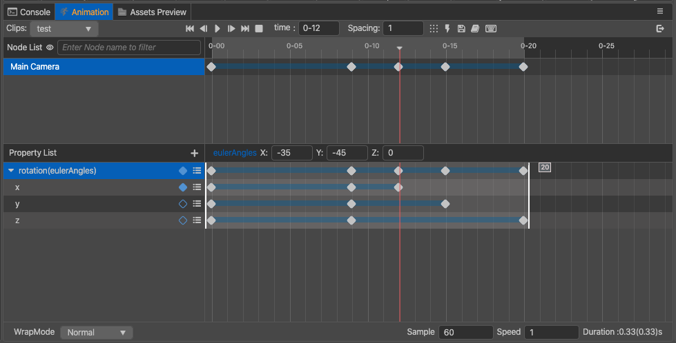

#### Project Setting Panel Update

It is divided into three parts: __Engine Manager__, __Project Setting__, and __Build__.

The Physics Collision Group uses the `PhysicsSystem.PhysicsGroup` type independently, and no longer shares the group configuration with `Node.Layers`:

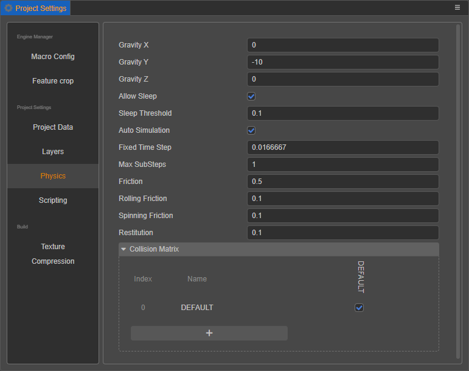

__Texture Compression__ is modified to configure the preset in the __Project Setting__ panel, then select the image resource in the __Assets__ panel, and then select the preset method.<br>
After the old project is upgraded, the editor will automatically scan all the compressed texture configurations in the project and sort out several presets. Since it is automatically scanned, the generated name may not be what you want, you can modify it here.

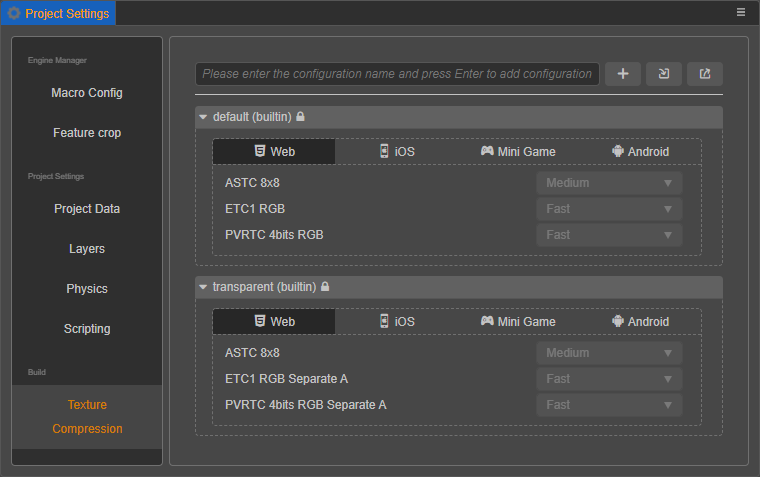

#### Editor Extension System Upgrade

Cocos Creator 3.x has a more powerful extension system. Almost all internal modules of the editor are built with extension system. You can quickly create your own extensions in the extended menu to achieve the customizations you want. In addition, v3.0 also provides an __Extension Manager__, which can easily manage the operation and uninstallation of all extensions.

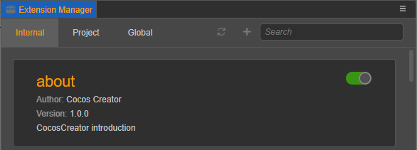

### Build Directory Differences

__Cocos Creator 2.x__ and __Cocos Creator 3.0__ differ to a certain extent in the directories generated after building on different platforms. Let's take __v2.4.3__ as an example and compare it with __v3.0__ on Web, Native and WeChat Mini Game platforms respectively.

#### Web

The directory generated by v2.4.3 after building the __Web Desktop__ is as follows:


The directory generated by v3.0 after building the __Web Desktop__ is as follows:

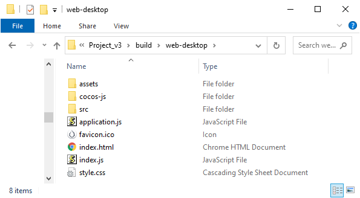

From the above two figures, notice the directory generated after building the Web Desktop, v2.4.3 and v3.0 are mostly the same, except with the following differences:

1. V3.0 puts all engine related code, such as core modules, physics modules, plugin scripts, etc., into the `web-desktop/cocos-js` directory, which looks clearer than v2.4.3, which was decentralized in the `web-desktop` directory.

    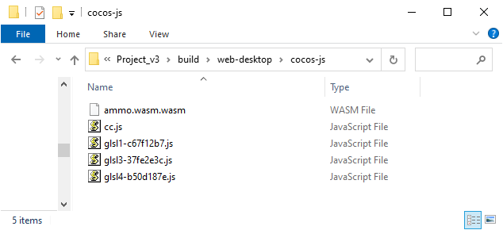

2. V2.4.3 has only one startup script `main.js`, while v3.0 has the following two startup scripts:

    - `index.js` -- Used to do some pre-processing work.

    - `application.js` -- Used to start the game.

3. The `src/settings.js` used to manage configuration in v2.4.3 is changed to `src/settings.json` in v3.0.

4. The splash screen `splash.png` in v2.4.3 is stored in `settings.json` by default in v3.0.

5. The `style-desktop.css` and `style-mobile.css` in v2.4.3 are combined into a single `style.css` in v3.0.

#### WeChat Mini Game

The directory generated by v2.4.3 after building the __WeChat Mini Game__ is as follows:

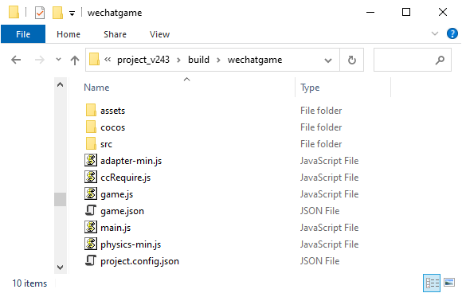

The directory generated by v3.0 after building the __WeChat Mini Game__ is as follows:

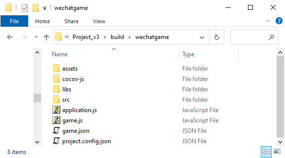

From the above two figures, notice the directory generated after building the __WeChat Mini Game__, v2.4.3 and v3.0 are mostly the same, except with the following differences:

1. V3.0 puts all engine related code, such as core modules, physics modules, plugin scripts, etc., into the `wechatgame/cocos-js` directory. While v2.4.3 scattered part of it in the `wechatgame` directory and part of it in the `wechatgame/cocos` directory.

    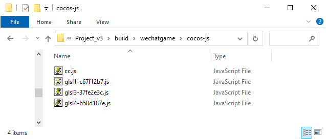

2. V2.4.3 compiles all the adaptation layer code of mini games into `adapter-min.js`, while v3.0 stores all the adaptation layer code as loose files in the `libs` directory, without compilation.

3. The startup script for v2.4.3 is `main.js`, and for v3.0 it is `application.js`.

4. V2.4.3 records all references of dynamic code in `ccRequire.js`. While v3.0 currently does not have this feature.

5. The `src/settings.js` used to manage configuration in v2.4.3 is changed to `src/settings.json` in v3.0.

#### Native

The release package generated by v2.4.3 after building the __Windows__ platform is as follows:


The release package generated by v3.0 after building the __Windows__ platform is as follows:


Notice from the above two figures, there is a big difference between v2.4.3 and v3.0 in the release package generated after building the __Windows__ platform.

1. The release package name for v2.4.3 is based on the __Template__ in the __Build__ panel (e.g.: `jsb-link`), while v3.0 is based on the __current build of the native platform__ (e.g.: `windows`, `Android`).

2. Since the underlying C++ code generated after building on each native platform (e.g.: Android, Windows) is completely consistent. V3.0 extracts the underlying C++ code that was stored in the release package `jsb-link/frameworks/runtime-src/Classes` directory in v2.4.3 and placed it in a shared `native/engine/common` folder under the project directory. This way, when building the native platform, if the folder is detected to already exist, this part will no longer be processed, to speed up the build.

    

3. The files related to the application layer in the v2.4.3 release package directory have been merged into the `assets` directory in v3.0.

    The application layer files include the following:

    - __assets__ -- Resource directory.
    - __jsb-adapter__ -- Directory, store the adaptation layer code.
    - __src__ -- Directory, store engine related code, plugin scripts, `settings.js` etc.
    - Related configuration files (`.cocos-project.json`, `cocos-project-template.json`, `project.json`).
    - The startup script (`main.js`).

    The `assets` directory structure of v3.0 is as follows:

    

    V3.0 has also made adjustments and changes accordingly during the merging process.

    - All the engine related code (such as core modules, physics modules, plugin scripts, etc.) that was originally placed in the `src` file in v2.4.3 is moved to the `assets/src/cocos-js` directory.

    - The `src/settings.js` used to manage configuration in v2.4.3 is changed to `src/settings.json` in v3.0.

4. V2.4.3 generates all the native build projects in the `frameworks/runtime-src` directory of the release package:

    

    While v3.0 generates the native build project in the `proj` directory and only generates the native build project for the current built. As shown below:

    

    Also, v3.0 separates the code and configuration, putting part of the code and configuration into the source code management, located in the `native/engine/name of the currently built platform` folder (e.g.: `native/engine/win32`, `native/engine/android`) under the project directory. Developers can integrate SDKs or do secondary development here. Deleting the release package directory generated after the build (e.g.: `build/windows`) will not affect the already integrated SDKs.

    

5. Some assets needed for compilation, such as application icons, application startup scripts, etc., v2.4.3 are stored in the build project, while v3.0 are stored in the `native/engine/name of the currently built platform` directory (e.g.: `native/engine/win32`, `native/engine/android`).

## Upgrade FAQ

### After the upgrade, the project script shows errors when opening in VS Code with operations such as binding component definitions

Cocos Creator 3.x enables Strict Mode for TypeScript, which will review the code more strictly and eliminate any problems that may occur due to negligence during the development process.

To avoid using strict mode, check __Enable loose mode__ in __Project -> Project Settings -> Scripting__ in the top menu bar of Creator. As a reminder, turning off strict mode is not encouraged as strict null checking can reduce some low-level errors in the code runtime.

For writing specifications in strict mode, please refer to the [Taxi Game 3D](https://github.com/cocos-creator/tutorial-taxi-game) as a test case.

### `Action` actions are all disabled

Cocos Creator 3.x removes the `Action` action system and uses the `Tween` tweening system instead.

### Modifying `size` and `anchor` of 2D nodes does not work

Obtain the UITransform component on the node first, and then use the corresponding interface, e.g.:

```typescript
const uiTrans = node.getComponent(UITransform)! ;
uiTrans.anchorX = 0.5;
uiTrans.setContentSize(size);
```

### Modifying the `color` of a 2D node does not work

Obtain the renderable component on the node (e.g. Sprite component) first, and then use the corresponding interface, e.g.:

```typescript
const uiColor = node.getComponent(Sprite)! ;
uiColor.color = color(255,255,255);
```

### Modifying `skew` for 2D nodes does not work

As of v3.0, the `skew` interface has been removed.

### Grouping is not available, but there are still grouping settings (Layers) in the project settings panel of Creator

The `group` group management in v2.x has been changed to `Layer` since v3.0, as shown below. In v2.x the group name is obtained from `node.group`, while in v3.x the group value is obtained from `node.layer` as __group value__, and the group value is set in exponential power of 2.


The layer value of User Layer 0 is: 2<sup>0</sup> = 1.<br>
The layer value of User Layer 1 is: 2<sup>1</sup> = 2.<br>
The layer value of User Layer 6 is: 2<sup>6</sup> = 64.

### The sibling node set by `zIndex` is invalid

As of v3.0, the `zIndex` interface has been removed. To reorder the node tree please use the `setSiblingIndex` method instead.

### The script mounted on the node is not available via `getComponent()`

Please look up the class name of the corresponding script, not the script name. v3.x script components are based on the class name defined in the script, not the script name. There are often problems with scripts not being found due to letter cases. Please refer to the [Create Script](../scripting/setup.md) documentation for more details.

### Dynamic loading of images in the `resources` folder is not found

When an image is set to `sprite-frame`, `texture` or other image type, an asset of the corresponding type will be generated in the __Assets__ panel. However, if loading an `testAssets/image` directly, the type obtained will be `ImageAsset` and it is necessary to specify the path to the specific child asset.

For example, if an image of type `sprite-frame` is set to `testAssets/image` in the `resources` folder, then to load `SpriteFrame` consider the following code:

```typescript
resources.load("testAssets/image/spriteFrame", SpriteFrame, (err, spriteFrame) => {
    this.node.getComponent(Sprite).spriteFrame = spriteFrame;
});
```

When loading an image of type `texture`, change `spriteFrame` to `texture`.

### The original physics collision callback is gone after the object generates a physics collision

Starting from v3.0, collision callbacks need to be registered at the beginning, unlike the original v2.x which generated callbacks directly. Therefore, developers need to add registration of the callback function to the physics callback script. For example:

```typescript
let collider = this.getComponent(Collider2D);
if (collider) {
    // Called only once when two colliding bodies start to make contact
    collider.on(Contact2DType.BEGIN_CONTACT, this.onBeginContact, this);

    // Called only once when two colliders end contact
    collider.on(Contact2DType.END_CONTACT, this.onEndContact, this);

    // Called each time the collider contact logic is about to be handled
    collider.on(Contact2DType.PRE_SOLVE, this.onPreSolve, this);

    // Called each time the collider contact logic is finished
    collider.on(Contact2DType.POST_SOLVE, this.onPostSolve, this);
    }
});
```

### After the upgrade, the physics collision grouping is gone

Currently the import plugin does not support the physics collision matrix, so for now the developer needs to set the collision matrix manually, which can be reset in the main menu __Project -> Project Settings -> Physics__ of Creator.

### The `audioEngine` interface for the audio system is not working and audio cannot be played

Starting from v3.0, the `audioEngine` interface has been removed and the __AudioSource__ component is used to control the playback of audio. Please refer to the [AudioSource Component](../audio-system/audiosource.md) documentation for more details.

### `Button` button is not clickable

To rule out code and rendering level problems, please check if the value of `Z` axis in the `Scale` property of the __Button__ node is 0, if so, change it to 1.

### The editor is stuck when making changes to the script after upgrade

Check if the property decorator `property` of the component type defined in the script after upgrade is undefined, if not, it is caused by the imported plugin being too old, please refer to [Plugin Upgrade](https://github.com/cocos-creator/plugin-import-2.x) to update the imported plugin Upgrade. After updating the imported plugins, you need to __re-do the project upgrade__.

### When modifying the `Position` of a node in a script after an upgrade, direct changes through the node (e.g. `node.x`) do not take effect

As of v3.0, direct access to coordinate positions is not allowed on `node` nodes, it is necessary to access `position` before accessing coordinate values. And `position` is a __read-only property__ in v3.x. To change it, please use the `setPosition` method. For example:

```typescript
// v2.x

// Access the coordinate axes
let xAxis = this.node.x;
// Modify the x-axis coordinates
this.node.x = 200;

// v3.x

// Access the axes
let xAxis = this.node.position.x;
// Modify the x-axis coordinates
this.node.setPosition(200);
```

## TypeScript Reference Tutorials

- [Tutorial: v3.0 TypeScript question answering and experience sharing](https://discuss.cocos2d-x.org/t/tutorial-3-0-typescript-question-answering-and-experience-sharing/52932)
- [TypeScript Official Website](https://www.typescriptlang.org/)
- [TypeScript - Classes](https://www.typescriptlang.org/docs/handbook/classes.html)
- [TypeScript - Decorators](https://www.typescriptlang.org/docs/handbook/decorators.html)
- [TypeScript - DefinitelyTyped](http://definitelytyped.org/)
- [Learn TypeScript in X minutes [cn]](https://learnxinyminutes.com/docs/zh-cn/typescript-cn/)
- [TypeScript GitHub](https://github.com/Microsoft/TypeScript)
- [The Best Resources For Learning TypeScript for Game Development](https://www.cocos.com/en/the-best-resources-for-learning-typescript-for-game-development)
- [3 Excuses Developers Give To Avoid TypeScript — and the Better Reasons They Should Use It](https://betterprogramming.pub/the-bad-reasons-people-avoid-typescript-and-the-better-reasons-why-they-shouldnt-86f8d98534de)
