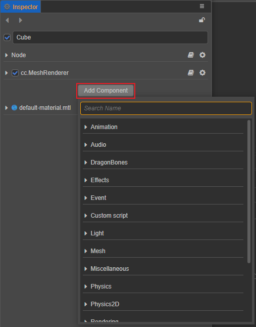
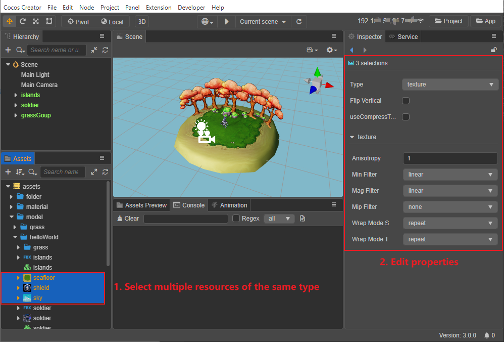
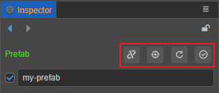

# 属性检查器

**属性检查器** 是我们查看并编辑当前选中节点、节点组件和资源的工作区域。在 **场景编辑器** 或者 **层级管理器** 选中节点，或者在 **资源管理器** 选中资源，就可以在 **属性检查器** 中显示并编辑属性。

## 面板总览

**属性检查器** 面板大致可以分为 **工具栏** 和 **属性设置** 两个部分。

## 工具栏

左上角的 **两个箭头** 是编辑历史记录，点击可前进/后退选中过的节点/资源。 
右上角的 **锁图标** 按钮可锁定面板，固定当前编辑的对象，不让面板随新的选中项而变动。

## 属性设置

在 **属性设置** 区域可以设置节点属性、组件属性、资源属性等。

### 节点名称和激活开关

节点名称，和 **层级管理器** 中的节点显示名称一致。

节点激活复选框表示节点的激活状态。不勾选时，节点处于非激活状态，节点会被暂停渲染，包括节点的子节点都会被隐藏（置灰）。

### 节点属性

点击节点名称下方的 `Node` 可以将节点的属性折叠或展开。`Node` 右侧有帮助文档和节点设置按钮：
- 帮助文档按钮可以跳转到节点相关的官方文档
- 节点设置按钮可以重置节点属性、复制/粘贴节点的值，以及分别重置节点的 `Position`/`Rotation`/`Scale` 属性。

    

节点的变换属性包括 **位置（Position）**、**旋转（Rotation）** 和 **缩放（Scale）**，修改节点的属性通常可以立刻在 **场景编辑器** 中看到节点的外观或位置变化。详情可参考 [坐标系和变换](../../concepts/scene/coord.md#%E5%8F%98%E6%8D%A2%E5%B1%9E%E6%80%A7)

如果需要批量修改节点属性，可在 **层级管理器** 中按 Shift 键选中多个节点，然后在 **属性检查器** 中批量设置。节点属性的批量设置与资源类似，具体可参考文末的资源多选批量设置部分。

### 组件属性设置

组件开启复选框表示组件的开启状态。不勾选时，组件处于关闭状态，不会参与渲染。

在节点属性下方，会列出节点上挂载的所有组件和组件的属性。和节点属性一样，点击组件的名称就会切换该组件属性的折叠/展开状态。在节点上挂载了很多组件的情况下，可以通过折叠不常修改的组件属性来获得更大的工作区域。

组件名称的右侧有 **帮助文档** 和 **组件设置** 的按钮：
- 帮助文档按钮可以跳转到该组件相关的官方文档介绍页面
- 组件设置按钮可以对组件执行重置、删除、向上移动、向下移动、复制组件、粘贴组件的值、粘贴成为新组件等功能。

各个组件的属性及设置都是不同的，详情可参考 [组件](../../editor/components/index.md)。

## 添加组件

点击 **添加组件** 按钮会出现组件列表，包含系统提供的组件和自定义脚本组件。添加组件的列表有一个搜索框，支持使用键盘的上下箭头切换，以及 **Enter** 确定选中。

开发者在 **资源管理器** 中的脚本，可直接拖拽到 **属性检查器** 面板生成一个脚本组件，或者通过 **添加组件 -> 自定义脚本** 添加。脚本组件的属性是由脚本声明的。不同类型的属性在 **属性检查器** 中有不同的控件外观和编辑方式。我们将在 [声明属性](../../scripting/ccclass.md) 一节中详细介绍属性的定义方法。

## 属性类型

**属性** 是组件脚本中声明的公开的并可被序列化存储在场景和动画数据中的变量。通过 **属性检查器** 可以快捷地修改属性设置，达到不需要修改脚本就可以调整游戏数据和玩法的目的。

通常可以根据变量使用内存位置不同将属性分为 **值类型** 和 **引用类型** 两大类。

### 值类型属性

**值类型** 包括数字、字符串、布尔、枚举等简单的占用很少内存的变量类型：

- `数值（Number）`：可以直接使用键盘输入，也可以按输入框旁边的上下箭头逐步增减属性值。
- `向量（Vec2）`：向量的控件是两个数值输入组合在一起，并且输入框上会以 x、y 标识每个数值对应的子属性名。
- `字符串（String）`：直接在文本框里用键盘输入字符串，字符串输入控件分为单行和多行两种，多行文本框可以按回车换行。
- `布尔（Boolean）`：以复选框的形式来编辑，选中状态表示属性值为 true，非选中状态表示 false。
- `枚举（Enum）`：以下拉菜单的形式编辑，点击枚举菜单，然后从弹出的菜单列表里选择一项，即可完成枚举值的修改。
- `颜色（Color）`：点击颜色属性预览框，会弹 **颜色取色器** 窗口，在这个窗口里可以用鼠标直接点选需要的颜色，或在下面的 RGBA 颜色输入框中直接输入指定的颜色。点击 **颜色取色器** 窗口以外的任何位置会关闭窗口并以最后选定的颜色作为属性值。例如颜色取色器组件：

  

### 引用类型属性

**引用类型** 包括 object 对象，比如节点、组件或资源。可通过 **拖拽节点或资源到属性栏中** 或 **弹出资源面板** 的方式选择并赋值。

## 批量操作

当需要批量设置 **同类型** 资源属性时，可在 **资源管理器** 中按 Shift 键并选中多个资源，**属性检查器** 中便会显示选中的资源数量以及可编辑的资源属性。设置完成后点击右上方的 **应用** 按钮即可。

批量修改节点属性也是一样的。但如果 **属性检查器** 中的属性显示以下几种状态，表示该属性在选中的多个资源中的属性值不一致，可根据需要选择是否继续批量修改该属性：

- 勾选框显示 **灰色**
- 输入框显示 **-**
- 选择框显示 **空白**

> **注意**：
> 1. 目前 Material 资源不支持批量设置操作。
> 2. **不同类型** 的资源可同时选中，但是不支持批量设置属性，**属性检查器** 中只会显示当前同时选中了几个资源。

## 编辑 Prefab 节点属性

Prefab 节点在 **属性检查器** 顶部工具栏中的功能包括：取消关联、定位资源、从资源还原、更新到资源。具体内容请参考 [预制资源（Prefab）](../../asset/prefab.md)。

> **注意**：编辑资源时请注意一定要记得点击右上角的 **绿色打勾** 按钮保存。
>
> 
