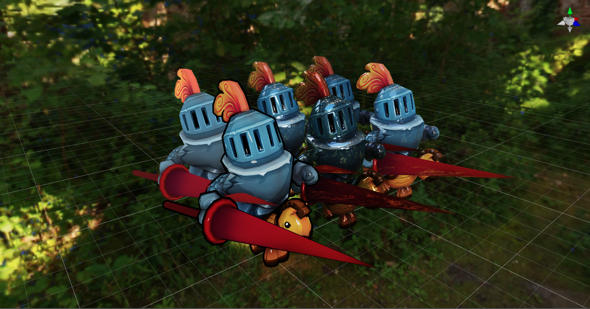

# 材质系统总览

在真实世界里，所有的物体都会与光交互。材质是一个数据集，包括纹理贴图、光照算法等，用于表现物体对光的交互，供渲染器读取数据，从而计算出光照结果，实现真实可信的光影效果。

材质可应用到网格物体上，用它控制物体的可视外观。它包含对 [着色器](../shader/index.md)（Shader）对象的引用。如果着色器对象定义了材质属性，则材质还可能会包含纹理贴图。比如一个立方形物体究竟是水池还是箱子，是一个木头箱子还是铁皮箱，以及它们在受光情况下的明暗表现、光点、光反射、光散射等效果，这些都可以通过材质来描述。

<!-- 
通过材质系统，既可以实现基于物理的真实渲染（PBR）， 也可以自定义非真实渲染（NPR）。
-->

本节将包含以下内容：

- [材质操作指南](material-inspector.md)
- [在脚本中使用材质](material-script.md)
- [材质接口说明](material-interface.md)
- [内置材质](builtin-material.md)
- [材质系统结构指南](material-structure.md) <!-- 需重做 -->
- [v2.x 升级 v3.0 指南](effect-2.x-to-3.0.md)

若要了解更多着色器的内容，请参考： [着色器](../shader/index.md)
