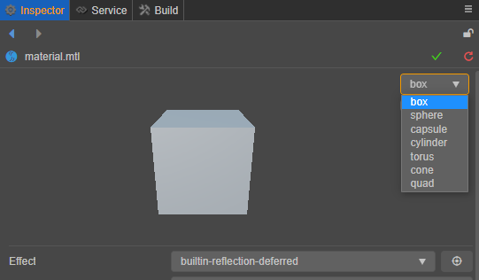
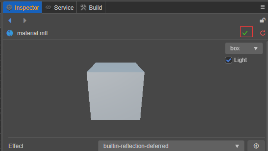

本节将主要介绍以下内容：

- 材质的创建和使用
- 属性查看器面板

# 创建材质

在编辑器的资源界面点击选择 **Create**->**Material** 可以创建一个新的材质。

在 v3.x 版本中创建材质会使用内置 PBR 材质进行创建。

# 使用材质

## 在网格渲染组件中使用

在任何持有 `MeshRenderer` ，`SkeletonMeshRenderer` 等的组件上选择 `Materials` ，通过下拉选择框，选择相应的材质。

### 导出模型资源中的材质

通常模型文件都由外部工具（Maya、Blend 或 3DMax 等）制作并导出为 `FBX` 文件。 

这些资源文件内部会带有在外部工具中制作的材质。

当导入引擎后，这些材质处于只读状态。 只有导出后才能进行写入。

点击 `FBX` 文件，在右侧的属性查看器内选择 `Material` 栏， 勾选 `Dump materils` 单选框，并选择保存材质则可以将材质导出为单独的文件：

 

## 在2D以及UI组件中使用

`UI` 和 `2D` 系统在默认情况下只支持一个单独的自定义材质。若留空则会使用引擎内置的默认材质。

若要进行自定义，在组件属性查看器内，通过选择 `Custom Material` 的下拉框选择相应的材质。

# 属性调整

属性查看器中的可编辑属性都来自于 `Effect` 系统。

若要了解更多关于 `Effect` 的内容，请查看 [ `Effect`系统]() 。

在材质内修改属性并不会影响 `Effect`。

## 选择 `Effect`

在属性查看器内的 `Effect` 下拉框中，可以选择当前引擎内置的 `Effect` 以及用户自定义 `Effect` 。

若要查看内置 `Effect`的说明请查看： [内置 `Effect`]()

若要了解更多 `Effect`的内容请查看： [ `Effect`系统]()

## 更改预览材质的模型

在属性查看器的右上角可以选择下拉菜单选择不同的预览模型：

## 保存和回退材质

在对材质进行修改后，属性查看器的右上角会出现保存和回退的按钮。

其按钮作用与预制体的操作一样

### 保存材质

在修改材质后，点击右上角的绿色的勾可以将材质资源进行保存。

### 回退材质

若对修改不满意，则可以点击红色回退按钮进行回退。

