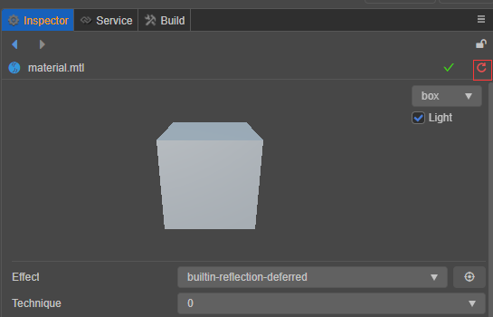

# 材质操作指南

本节将主要介绍以下内容：

- 材质的创建和使用
- 属性查看器面板（ Inspector ）

## 创建材质

在编辑器的资源界面点击选择 **创建**->**材质（Material）** 可以创建一个新的材质。

在 v3.x 版本中创建材质会使用内置 PBR 着色器进行创建。

## 使用材质

### 在网格渲染组件中使用

在任何持有 `MeshRenderer` ，`SkeletonMeshRenderer` 等的组件上选择 `Materials` ，通过下拉选择框，选择相应的材质。

也可以直接从 Assets 目录拖拽材质到对应的组件属性查看器上。

#### 导出模型资源中的材质

通常模型文件都由外部工具（Maya、Blender 或 3DMax 等）制作并导出为 `FBX` 文件。

这些资源文件内部可能会带有在外部工具中制作的材质。

当导入引擎后，这些材质处于只读状态。

若要使用这些材质，点击 `FBX` 文件，在右侧的属性查看器内选择 `Material` 栏， 勾选 `Dump materials` 单选框，并选择保存材质则可以将材质提取为单独的文件。提取完成后，这些材质资源会自动和 `MeshRenderer` 中的 `Materials` 属性绑定。

 

开发者可查看 [模型资源](asset/model/mesh.md) 查看更多容。

### 在2D以及UI组件中使用

`UI` 和 `2D` 系统在默认情况下只支持一个单独的自定义材质。若留空则会使用引擎内置的标准材质。

若要进行自定义，在组件属性查看器内，通过选择 `Custom Material` 的下拉框选择相应的材质。

## 属性调整

属性查看器中的可编辑属性都来自于着色器系统。

若要了解更多关于着色器的内容，请查看 [着色器](../shader/index.md) 。

在材质内修改属性并不会影响着色器。

### 选择着色器

在属性查看器内的着色器下拉框中，可以选择当前引擎内置的着色器以及用户自定义着色器。

对于内置着色器的用法可查看：[内置着色器](../shader/effect-buildin.md)

### 更改预览材质的模型

在属性查看器的右上角可以选择下拉菜单选择不同的预览模型：

### 保存和重置（Reset）材质

在对材质进行修改后，属性查看器的右上角会出现保存和重置的按钮。

#### 保存材质

在修改材质后，点击右上角的绿色的勾可以将材质资源进行保存。

>注意：一旦保存，则不能再重置。

#### 重置（Reset）材质

若对修改不满意，则可以点击红色按钮进行重置。

重置会将材质的属性重置到上一次保存的状态。

>注意：未保存的修改会丢失。

