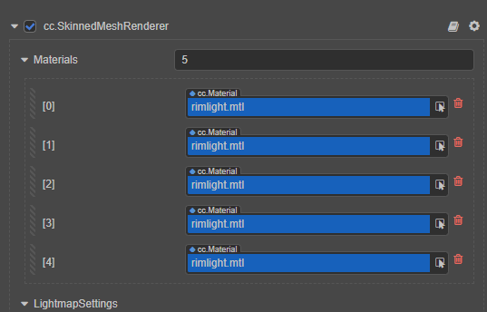

# 在脚本中使用

## 创建材质

Material 资源可以看成是 EffectAsset 在场景中的资源实例，它本身的可配置参数包括：
- **effectAsset** 或 **effectName**：effect 资源引用，指定使用哪个 EffectAsset 所描述的流程进行渲染。（必备）
- **technique**：指定使用 EffectAsset 中的第几个 technique，默认为第 0 个。
- **defines**：宏定义列表，指定开启哪些 [预处理宏定义](../shader/macros.md)，默认全部关闭。
- **states**：管线状态重载列表，指定对渲染管线状态（深度模板透明混合等）有哪些重载，默认与 effect 声明一致。

创建代码示例：

```ts
const mat = new Material();
mat.initialize({
  effectName: 'pipeline/skybox',
  defines: {
    USE_RGBE_CUBEMAP: true
  }
});
```

## 使用材质

对任意可渲染组件，设置其材质后：



可通过下列代码访问：

>**注意 1 ：这里访问的是共享材质
>注意 2 ：材质中存在共享材质和材质实例两种情况，共享材质无法和材质实例进行合批。关于这一点，可查看 [材质接口说明](material-interface.md) 了解详细机制。**

```ts
let renderable = this.getComponent(RenderableComponent);

//获取可渲染组件的材质
let material = renderable.getMaterial(0)

//设置可渲染组件的材质
renderable.setMaterial(mat, 0);

let sprite = this.node.getComponent(Sprite)

//获取 2D 可渲染组件的自定义材质
let customMaterial = sprite.customMaterial;

//设置 2D 可渲染组件的自定义材质
sprite.customMaterial = mat;
```

## 设置材质的属性

在材质初始化以后，只能通过 `Material.setProperty` 来设置材质的 `Uniform` 属性。

下列代码演示了如何修改材质的 `Uniform` 属性：

```ts
mat.setProperty("uniform name", uniformValue)
```

`Uniform` 对应了 `Shader` 内声明的由 `Uniform` 限定的变量。 若要了解更多 `Uniform` 的信息可参考： [Uniform](../shader/uniform.md)

若需频繁设置 `Uniform` 的值，请使用 `Pass.setUniform` 来获得更好的性能。

<!-- 
## 重新编译着色器

若需重新编译着色器代码，可通过 `recompileShaders` 方法实现。

>注意：该方法仅对材质实例生效。

-->

<!-- 
## 共享材质

材质资源文件在加载后，全局会共享一份。任何对该材质的改动都会反馈到使用这些材质的组件中。

在默认情况下 `Materail.shareMaterial` 会返回材质数组的第一个材质。

## 材质实例

每一个材质资源（Material Asset）在运行时都会创建一份新的材质实例。

材质实例为材质的运行时实例。

-->


