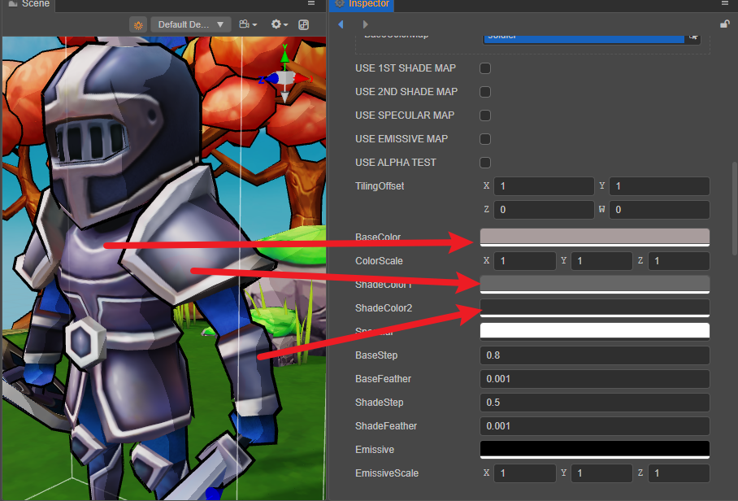

# 卡通渲染

 相对于[真实渲染](effect-buildin-pbr.md)（PBR），非真实渲染（Non-Photorealistic Rendering NPR）通过特性化渲染，实现于真实世界完全不同的美术表现。

 卡通渲染（Toon）是非真实渲染的常见实现之一。

 常见的卡通渲染内容包含

- 对物体进行边缘描边
- 模拟色阶不连续现象
- 其他光照计算

 

## 参数

| 参数         | 说明                                                              |
| :------------- | :---------------------------------------------------------------- |
| tilingOffset   | 模型 UV 的平铺和偏移量，xy 对应平铺，zw 对应偏移|
| mainColor      | 主颜色，该颜色会作为最初的色阶|
| colorScale     | 颜色缩放，对主颜色，一阶和二阶颜色的 RGB 通道相乘 |
| alphaThreshold | 半透明物体剪裁的 alpha 区间
| shadeColor1    | 一阶色阶的颜色，该颜色会作为卡通着色的中间色阶 |
| shadeColor2    | 二阶色阶的颜色，该颜色会作为卡通着色的最后一个色阶 |
| specular       | 反射光颜色
| baseStep       |
| baseFeather    |
| shadeStep      |
| shadeFeather   |
| emissive       | 自发光颜色，独立于光照计算，由模型本身直接发散出的颜色  |
| emissiveScale  | 自发光强度 用于控制自发光颜色对于最终颜色的影响权重 |
| normalStrenth  | 法线伸缩量 只有在启用 USE_NORMAL_MAP 后才可以调整并对法线的 xy 轴进行缩放|
| normalMap      | 法线贴图
| mainTexture    | 基础着色器贴图，定义物体的基础纹理
| shadeMap1      | 一阶色阶纹理   若指定则会和 shadeColor1 相乘 |
| shadeMap2      | 二阶色阶纹理   若指定则会和 shadeColor2 相乘 |
| specularMap    | 反射光贴图 若有指定，则会和反射光颜色做相乘， |
| emissiveMap    | 自发光贴图 如果有指定，这项会和自发光颜色相乘，因此需要把自发光颜色（默认是黑色）调高才会有效果 |

## 宏

 | 宏名                          | 说明                      |
 | :---------------------------- | :------------------------ |
 | USE_BATCHING | 是否启用动态 VB 合并式合批 |
| USE_INSTANCING | 是否启用动态 instancing |
 | USE_OUTLINE_PASS              | 是否启用描边 Pass         |
 | USE_NORMAL_MAP                | 是否使用法线贴图          |
 | USE_BASE_COLOR_MAP            | 是否使用基础贴图          |
 | USE_1ST_SHADE_MAP             | 是否使用贴图作为一阶色阶 |
 | USE_2ND_SHADE_MAP             | 是否使用贴图作为二阶色阶图 |
 | USE_EMISSIVE_MAP              | 是否使用发射？贴图        |
 | USE_ALPHA_TEST                | 是否进行半透明测试        |
 | USE_SPECULAR_MAP              | 是否使用反射光贴图        |
 | BASE_COLOR_MAP_AS_SHADE_MAP_1 | 使用 baseColorMap 作为一阶着色 |
 | BASE_COLOR_MAP_AS_SHADE_MAP_2 | 使用 baseColorMap 作为二阶着色 |
 | SHADE_MAP_1_AS_SHADE_MAP_2    | 给二阶着色叠加一阶着色|

## 原理

 卡通渲染由两个 Pass 组成

- Pass 0 描边（可选）
- Pass 1 正常绘制

### Pass 0

描边时，选择 `CullMode=FRONT` 将物体朝前的面进行剔除，之后将顶点按照法线方向进行扩展。此操作将得到一个略比原模型更大的单色模型。

可通过勾选 `USE_OUTLINE_PASS` 开启或关闭。

 

### Pass 1

色阶不连续现象通过三个颜色组成：

- `baseColor`
- `shadeColor1`
- `shadeColor2`

其颜色对应关系如下图：

勾选 `USE_1ST_SHADE_MAP` 和 `USE_2ND_SHADE_MAP` 的情况下，使用外部进行纹理模拟色阶不连续现象，该纹理通常采用手绘或外部工具生成。

通过着色器的 `surf` 方法计算表面着色器（`ToonSurface`）的参数，并由 `CCToonShading` 方法计算最终的着色。
