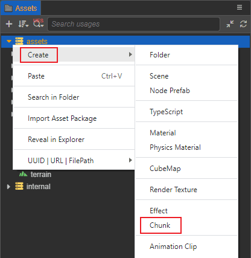
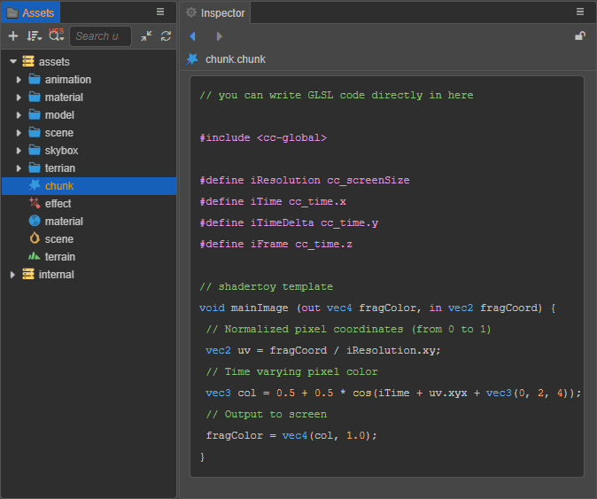

# 着色器片段（Chunk）

着色器片段（Chunk）是一种跨文件代码引用机制，使 Cocos Effect 代码片段可以在不同的文件之间进行复用。

着色器片段的语法基于 **GLSL 300 ES**，在资源加载时会进行预编译，生成目标 Shader 代码。

## 创建着色器片段

在 **资源管理器** 面板中点击右键，选择 **创建 -> 着色器片段（Chunk）**：



便可创建一个默认名为 **chunk** 的着色器片段，如下图：



## Include 机制

在标准 GLSL 语法基础上，Cocos Effect 引入了 C 语言风格的语法扩展 — Include 机制。

通过 include 机制，可以在任意 Shader 代码（CCProgram 块或独立的头文件）中引入其他代码片段，如下所示：

```c
// 引入引擎内置着色器片段
#include <cc-global>

// 引入自定义着色器片段
#include "../headers/my-shading-algorithm.chunk"
```

关规则和注意事项：

- 着色器片段的扩展名默认为 `.chunk`，在 include 时可忽略。引入其他代码片段时可使用双括号或者尖括号，二者无区别，例如：

  ```c
  #include "filename.chunk"
  #include "filename" // 可忽略扩展名
  #include <filename.chunk>
  #include <filename>  // 可忽略扩展名
  ```

- 在 Cocos Effect 编译时着色器片段会被展开，且只会展开一次。因此书写时不用担心，每个模块都可以包含自己依赖的着色器片段，即使这中间有重复；
- 所有不参与运行时实际计算流程的函数声明会在编译时被剔除，因此可以放心包含各类工具函数，不用担心生成的目标代码会有冗余；
- 着色器片段引用可以指定基于当前文件目录的相对路径（以下统称"相对路径"），也可以指定基于 Cocos Creator 编辑器 internal DB 路径下的 `assets/chunks` 目录的相对路径（以下统称"项目绝对路径"），两个位置如果有同名文件，则后者（项目绝对路径）优先；
- 引用了编辑器其他 DB（Database）的着色器片段只能指定项目绝对路径。当多个 DB 在此路径下有相同文件时，DB 优先级为：用户项目 DB > 插件 DB > Internal DB；
- Creator 提供了一些内置着色器片段资源，主要包括一些常用的工具函数和标准光照模型等，位于 [资源管理器](../editor/assets/index.md) 面板中的内置资源数据库（简称 DB）`internal` 的 `chunks` 目录下，因此可以不加目录直接引用。
- 所有在同一个 Cocos Effect 文件中声明的 CCProgram 代码块都可以相互引用。
