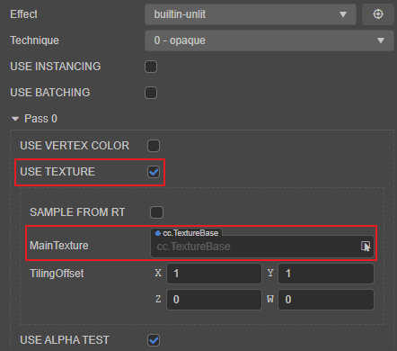

# 预处理宏定义


Cocos Effect 系统的设计倾向于在游戏项目运行时可以方便地利用 shader 中的各类预处理宏，动态处理逻辑。编辑器会在加载资源时收集所有在 shader 中出现的宏定义，然后引擎在运行时动态地将需要的声明加入 shader 内容。所以如果要使用这些预处理宏，只需要像下面这样处理即可：

```glsl
CCProgram unlit-vs %{
  #if USE_TEXTURE
    // ...
  #endif
}%
```

所有的宏定义都会被显示在 **属性检查器** 上，以便随时调整。宏定义的声明规则有以下几点：
- 当定义一个简单宏定义（用布尔开关宏）时，无法指定该宏的默认值，所有的宏定义默认值都为 false，需要通过 **属性检查器** 或代码修改。如果设计上某些宏之间存在互斥关系（不可能同时为 true），可以通过使用 tag 声明的宏来处理，请参考 [Macro Tags](#Macro-Tags)。
- 运行时会显式定义所有 shader 中出现的自定义宏（默认定义为 0），所以 **除了 GLSL 语言内置宏外（`GL_` 开头的 extension 等）**，请不要使用 `#ifdef` 或 `#if defined` 这样的形式做判断，否则执行结果会始终为 true；
- 运行时会对宏定义组合计算 hash，目前的计算机制在宏定义组合数 **2^32** 以内（一个 int 的范围），相对高效，对应到 shader 中相当于 32 个布尔开关。所以请尽量不要超出此限制，定义过多运行时可调整的宏定义，会影响运行效率。
- 宏定义不仅可以应用在 CCProgram 里，动态处理宏定义内的逻辑，还可以应用在 CCEffect 中，动态显示可编辑属性。

    ```glsl
    CCEffect %{
        # ...
        properties:
            mainTexture:  { value: white, editor: { parent: USE_TEXTURE } }
            # ...
    }%

    CCProgram unlit-fs %{
        // ...
        vec4 frag () {
            #if USE_TEXTURE
              // 处理 mainTexture 逻辑
            #endif
        }
    }%
    ```

    

## Macro Tags

虽然引擎会尝试自动识别所有出现在预处理分支逻辑中 (#if) 的宏定义，但有时实际使用方式要比简单的布尔开关更复杂一些，比如下面的条件判断：

```glsl
// macro defined within certain numerical 'range'
#if LAYERS == 4
  // ...
#elif LAYERS == 5
  // ...
#endif
// multiple discrete 'options'
float metallic = texture(pbrMap, uv).METALLIC_SOURCE;
```

针对这类有固定取值范围或固定选项的宏定义，需要选择一个合适的 tag 显式声明：

| Tag     | 说明 | 默认值 | 备注 |
| :-- | :-- | :-- | :-- |
| range   | 一个长度为 2 的数组。首元素为最小值，末元素为最大值 | [0, 3] | 针对连续数字类型的宏定义，显式指定它的取值范围。<br>范围应当控制到最小，有利于运行时的 shader 管理 |
| options | 一个任意长度的数组，每个元素都是一个可能的取值 | 如未显式声明则不会定义任何宏 | 针对有清晰选项的宏定义，显式指定它的可用选项 |

比如下面这样的声明：

```glsl
#pragma define LAYERS range([4, 5])
#pragma define METALLIC_SOURCE options([r, g, b, a])
```

一个是名为 `LAYERS` 的宏定义，它在运行时可能的取值范围为 `[4, 5]`。<br>
另一个是名为 `METALLIC_SOURCE` 的宏定义，它在运行时可能的取值为 'r'、'g'、'b'、'a' 四种。

**注意**：语法中的每个 tag 都只有一个参数，这个参数可以直接用 YAML 语法指定。

### Functional Macros

由于 WebGL1 不支持原生，Creator 将函数式宏定义提供为 effect 编译期的功能，输出的 shader 中就已经将此类宏定义展开。这非常适用于 inline 一些简单的工具函数，或需要大量重复定义的相似代码。事实上，内置头文件中不少工具函数都是函数式宏定义：

```glsl
#define CCDecode(position) \
  position = vec4(a_position, 1.0)
#define CCVertInput(position) \
  CCDecode(position);         \
  #if CC_USE_SKINNING         \
    CCSkin(position);         \
  #endif                      \
  #pragma // empty pragma trick to get rid of trailing semicolons at effect compile time
```

但与 C/C++ 的宏定义系统相同，这套机制不会对宏定义的 [卫生情况](https://en.wikipedia.org/wiki/Hygienic_macro) 做任何处理，由不卫生的宏展开而带来的问题需要开发者自行处理，因此我们推荐，并也确保所有内置头文件中，谨慎定义含有局部变量的预处理宏：

```glsl
// please do be careful with unhygienic macros like this
#define INCI(i) do { int a=0; ++i; } while(0)
// when invoking
int a = 4, b = 8;
INCI(b); // correct, b would be 9 after this
INCI(a); // wrong! a would still be 4
