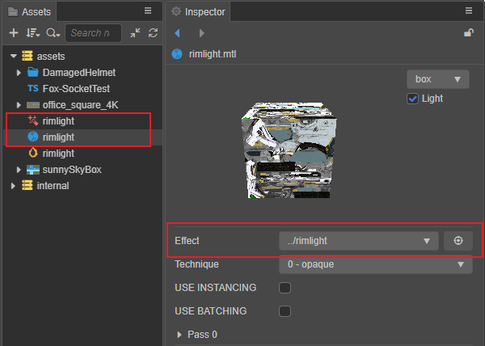
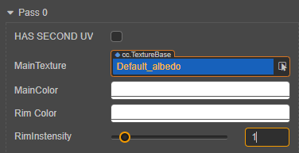

# 3D 着色器：RimLight

**RimLight** 也称为“内发光”、“轮廓光”或者“边缘光”，是一种通过使物体的边缘发出高亮，让物体更加生动的技术。

**RimLight** 是[菲涅尔现象](#菲涅尔现象)的一种应用，通过计算物体法线和视角方向的夹角的大小，调整发光的位置和颜色，是一种简单，高效的提升渲染效果的着色器。
在边缘光的计算中，视线和法线的夹角越大，则边缘光越明显。


<!-- 
RimLight 实现简单，效率高，效果也不错。 
-->
本文将通过实现一个 RimLight 效果，来演示如何编写一个在 Cocos Creator 可用于 3D 模型渲染的着色器（`Cocos Effect`） 。

## 新建着色器

首先参考 [新建着色器](write-effect-overview.md) 新建一个名为 `rimlight.effect` 的着色器，并创建一个使用该着色器的材质 `rimlight.mtl`。



## CCEffect

暂时不考虑半透明的情况下，可以将 `transparent` 部分删掉，并将 `frag` 修改为： `rimlight-fs:frag`。

其中 `rimlight-fs` 是接下来要实现的边缘光的片元着色器部分。

```yaml
# 删除如下的部分
- name: transparent
    passes:
    - vert: general-vs:vert # builtin header
      frag: rimlight-fs:frag
      blendState:
        targets:
        - blend: true
          blendSrc: src_alpha
          blendDst: one_minus_src_alpha
          blendSrcAlpha: src_alpha
          blendDstAlpha: one_minus_src_alpha
      properties: *props 
```

为了方便调整边缘光的颜色，增加一个用于调整边缘光颜色的属性 `rimLightColor`，由于不考虑半透明，只使用该颜色的 RGB 通道：

```yaml
rimLightColor:  { value: [1.0, 1.0, 1.0],   # RGB 的默认值
                  target: rimColor.rgb,     # 绑定到 Uniform rimColor 的 RGB 通道上
                  editor: {                 # 在 material 的属性检查器内的样式定义
                    displayName: Rim Color, # 显示 Rim Color 作为显示名称 
                    type: color } }         # 该字段的类型为颜色值
```

此时的 CCEffect 代码：

```yaml
CCEffect %{
  techniques:
  - name: opaque
    passes:
    - vert: general-vs:vert # builtin header
      frag: rimlight-fs:frag
      properties: &props
        mainTexture:    { value: white } 
        mainColor:      { value: [1, 1, 1, 1], editor: { type: color } }    
        # Rim Light 的颜色，只依赖 rgb 三个通道的分量
        rimLightColor:  { value: [1.0, 1.0, 1.0], target: rimColor.rgb, editor: { displayName: Rim Color, type: color } }
}%
```

注意需要在片元着色器的 `uniform Constant` 内增加对应的 `rimColor` 字段：

```glsl
uniform Constant {        
  vec4 mainColor;    
  vec4 rimColor;  
}; 
```

这个绑定意味着着色器的 `rimLightColor` 的 RGB 分量的值，会通过引擎传输到 Uniform `rimColor` 的 rgb 三个分量里。

> 引擎规定不能使用 vec3 类型的矢量来避免 [implict padding](./effect-syntax.md)，因此在使用 3 维向量（vec3）时，可选择用 4 维向量（vec4）代替。
> 不用担心，alpha 通道会被利用起来不被浪费。

## 顶点着色器

顶点着色器直接沿用引擎内置的通用顶点着色器：

```yaml
 - vert: general-vs:vert # builtin header
```

## 片元着色器

将通过模板创建的片元着色器代码内 `CCProgram unlit-fs` 修改为： `CCProgram rimlight-fs` 。

修改前：

```glsl
CCProgram unlit-fs %{
  precision highp float;
  ...
}%
```

修改后：

```glsl
CCProgram rimlight-fs %{
  precision highp float;
  ...
}%
```

要计算视点的方向，需要获取当前 **摄像机** 的位置，使用 **摄像机** 的位置减去当前的坐标来获取视角的向量，**摄像机** 位置的全局 Uniform 存放 `cc-global` 这个着色器片段的 `cc_cameraPos` 变量内。通过 `include` 关键字，包含这个头文件：

```glsl
#include <cc-global>  // 包含 Cocos Creator 内置全局变量  
```

着色器代码：

```glsl
CCProgram rimlight-fs %{
  precision highp float;  
  #include <cc-global>  // 包含 Cocos Creator 内置全局变量  
  #include <output>
  #include <cc-fog-fs>

  ...
}
```

> 内置的全局 Uniform 可通过 [全局 Uniform](uniform.md) 查看。

视线方向的计算是通过当前相机的位置（`cc_cameraPos`）减去片元着色器内由顶点着色器传入的位置信息 `in vec3 v_position`：

```glsl
vec3 viewDirection = cc_cameraPos.xyz - v_position; //计算视点的方向
```

我们不关心视线向量的长度，因此得到 `viewDirection` 后，通过 `normalize` 方法进行归一化处理：

```glsl
vec3 normalizedViewDirection = normalize(viewDirection);  //对视点方向进行归一化
```

`cc_cameraPos` 的 xyz 分量表示了相机的位置。

此时的片元着色器代码：

```glsl
  vec4 frag(){ 
    vec3 viewDirection = cc_cameraPos.xyz - v_position; //计算视点的方向
    vec3 normalizedViewDirection = normalize(viewDirection);  //对视点方向进行归一化
    vec4 col = mainColor * texture(mainTexture, v_uv); //计算最终的颜色
    CC_APPLY_FOG(col, v_position);
    return CCFragOutput(col);  
  }
```

接下来需要计算法线和视角的夹角，由于使用的是内置标准顶点着色器 `general-vs:vert` ，法线已由顶点着色器传入到片元着色器，若要在片元着色器里面使用，只需在代码如增加：

```glsl
in vec3 v_normal;
```

此时的片元着色器：

```glsl
CCProgram rimlight-fs %{
  precision highp float;
  #include <cc-global>
  #include <output>
  #include <cc-fog-fs>

  in vec2 v_uv;
  in vec3 v_normal;
  in vec3 v_position;

  ....
}
```

法线由于管线的插值，不再处于归一化状态， 因此需要对法线进行归一化处理，使用 `normalize` 函数进行归一化：

```glsl
vec3 normal = normalize(v_normal);  //重新归一化法线。
```

此时的 `frag` 函数：

```glsl
vec4 frag(){ 
    vec3 normal = normalize(v_normal);  //重新归一化法线。
    vec3 viewDirection = cc_cameraPos.xyz - v_position; //计算视点的方向
    vec3 normalizedViewDirection = normalize(viewDirection);  //对视点方向进行归一化
    vec4 col = mainColor * texture(mainTexture, v_uv); //计算最终的颜色
    CC_APPLY_FOG(col, v_position);
    return CCFragOutput(col);  
}
```

这时可计算法线和视角的夹角，在线性代数里面，点积表示为两个向量的模乘以夹角的余弦值：

```math
a·b = |a|*|b|*cos(θ)
```

通过简单的交换律可得出：

```math
cos(θ) = a·b /(|a|*|b|)
```

由于法线和视角方向都已经归一化，因此他们的模为 1，点积的结果则表示为法线和视角的 cos 值。

```math
cos(θ) = a·b
```

将其转化为代码：

```glsl
dot(normal, normalizedViewDirection)
```

注意点积的计算可能会出现小于 0 的情况，而颜色是正值，通过 `max` 函数将其约束在 [0, 1] 这个范围内：

```glsl
max(dot(normal, normalizedViewDirection), 0.0)
```

此时可根据点积的结果来调整 RimLight 的颜色：

```glsl
float rimPower = max(dot(normal, normalizedViewDirection), 0.0);//计算 RimLight 的亮度
vec4 col = mainColor * texture(mainTexture, v_uv); //计算最终的颜色
col.rgb += rimPower * rimColor.rgb; //增加边缘光
```

着色器代码如下：

```glsl
vec4 frag(){ 
    vec3 normal = normalize(v_normal);//重新归一化法线。
    vec3 viewDirection = cc_cameraPos.xyz - v_position; //计算视点的方向
    vec3 normalizedViewDirection = normalize(viewDirection);  //对视点方向进行归一化
    float rimPower = max(dot(normal, normalizedViewDirection), 0.0); //计算 RimLight 的亮度
    vec4 col = mainColor * texture(mainTexture, v_uv); //计算最终的颜色
    col.rgb += rimPower * rimColor.rgb; //增加边缘光
    CC_APPLY_FOG(col, v_position);
    return CCFragOutput(col);  
}
```

可观察到物体中心比边缘更亮，这是因为边缘顶点的法线和视角的夹角更大，得到的余弦值更小。

>此步骤若无法观察到效果，可调整 `MainColor` 使其不为白色。因为默认的 `MainColor` 颜色是白色遮盖了边缘光的颜色。


要调整这个结果，只需用 1 减去点积的结果即可，删除下面的代码：

~~``` float rimPower = max(dot(normal, normalizedViewDirection), 0.0); ```~~

并增加：

```glsl
float rimPower = 1.0 - max(dot(normal, normalizedViewDirection), 0.0);
```

片元着色器代码：

```glsl
vec4 frag(){ 
    vec3 normal = normalize(v_normal);  //重新归一化法线。
    vec3 viewDirection = cc_cameraPos.xyz - v_position; //计算视点的方向
    vec3 normalizedViewDirection = normalize(viewDirection);  //对视点方向进行归一化
    float rimPower = 1.0 - max(dot(normal, normalizedViewDirection), 0.0);
    vec4 col = mainColor * texture(mainTexture, v_uv); //计算最终的颜色
    col.rgb += rimPower * rimColor.rgb; //增加边缘光
    CC_APPLY_FOG(col, v_position);
    return CCFragOutput(col);  
  }
```


虽然可观察到边缘光效果，但是光照太强，并且不方便调整，可在着色器的 CCEffect 段内增加一个可调整的参数 rimIntensity。由于之前 rimColor 的 alpha 分量没有被使用到，因此借用该分量进行绑定可节约额外的 Uniform。

> 写着色器时，需要避免 implict padding，关于这点可以参考: [UBO 内存布局](./effect-syntax.md)，这里使用未被使用的 alpha 通道来存储边缘光的强度可以最大限度的利用 `rimColor` 的字段。

在 CCEffect 内增加如下代码：

```yaml
rimInstensity:  { value: 1.0,         # 默认值为 1 
                  target: rimColor.a, # 绑定到 rimColor 的 alpha 通道
                  editor: {           # 属性检查器的样式
                    slide: true,      # 使用滑动条来作为显示样式
                    range: [0, 10],   # 滑动条的值范围
                    step: 0.1}        # 每次点击调整按钮时，数值的变化值
```

此时的CCEffect 代码：

```yaml
CCEffect %{
  techniques:
  - name: opaque
    passes:
    - vert: general-vs:vert # builtin header
      frag: rimlight-fs:frag
      properties: &props
        mainTexture:    { value: white } 
        mainColor:      { value: [1, 1, 1, 1], editor: { type: color } }    
        # Rim Light 的颜色，只依赖 rgb 三个通道的分量
        rimLightColor:  { value: [1.0, 1.0, 1.0], target: rimColor.rgb, editor: { displayName: Rim Color, type: color } }
        # rimLightColor 的 alpha 通道没有被用到，复用该通道用来描述 rimLightColor 的强度。
        rimInstensity:  { value: 1.0, target: rimColor.a, editor: {slide: true, range: [0, 10], step: 0.1}}   
}%               

```

增加此属性后，材质 **属性检查器** 上会增加可调整的 RimIntensity：



通过 pow 函数调整边缘光，使其范围不是线性变化，可体现更好的效果，删除如下代码：

~~``` col.rgb += rimPower * rimColor.rgb; ```~~

新增下列代码：

```glsl
float rimInstensity = rimColor.a; // alpha 通道为亮度的指数
col.rgb += pow(rimPower, rimInstensity) * rimColor.rgb;  // 使用 pow 函数对点积进行指数级修改
```

>pow 是 GLSL 的内置函数，其形式为：pow(x, p)，代表以 x 为底数，p 为指数的指数函数。

最终片元着色器代码：

```glsl
  vec4 frag(){ 
    vec3 normal = normalize(v_normal);  //重新归一化法线。
    vec3 viewDirection = cc_cameraPos.xyz - v_position; //计算视点的方向
    vec3 normalizedViewDirection = normalize(viewDirection);  //对视点方向进行归一化
    float rimPower = 1.0 - max(dot(normal, normalizedViewDirection), 0.0);//计算 RimLight 的亮度
    vec4 col = mainColor * texture(mainTexture, v_uv); //计算最终的颜色
    float rimInstensity = rimColor.a;  // alpha 通道为亮度的指数
    col.rgb += pow(rimPower, rimInstensity) * rimColor.rgb; //增加边缘光
    CC_APPLY_FOG(col, v_position); 
    return CCFragOutput(col);  
  }
```

之后将材质 **属性检查器** 上的 rimIntensity 的值修改为 3：


此时可观察到边缘光照更自然：


通过 Rim Color 和 rimIntensity 可方便的调整边缘光的颜色和强度：


完整的着色器代码：

```glsl
CCEffect %{
  techniques:
  - name: opaque
    passes:
    - vert: general-vs:vert # builtin header
      frag: rimlight-fs:frag
      properties: &props
        mainTexture:    { value: white } 
        mainColor:      { value: [1, 1, 1, 1], editor: { type: color } }    
        # Rim Light 的颜色，只依赖 rgb 三个通道的分量
        rimLightColor:  { value: [1.0, 1.0, 1.0], target: rimColor.rgb, editor: { displayName: Rim Color, type: color } }
        # rimLightColor 的 alpha 通道没有被用到，复用该通道用来描述 rimLightColor 的强度。
        rimInstensity:  { value: 1.0, target: rimColor.a, editor: {slide: true, range: [0, 10], step: 0.1}}   
}%

CCProgram rimlight-fs %{
  precision highp float;
  #include <cc-global>
  #include <output>
  #include <cc-fog-fs>

  in vec2 v_uv;
  in vec3 v_normal;
  in vec3 v_position;

  uniform sampler2D mainTexture;

  uniform Constant {
    vec4 mainColor;
    vec4 rimColor;  
  }; 
  vec4 frag(){     
    vec3 normal = normalize(v_normal);  //重新归一化法线。
    vec3 viewDirection = cc_cameraPos.xyz - v_position; //计算视点的方向
    vec3 normalizedViewDirection = normalize(viewDirection);  //对视点方向进行归一化
    float rimPower = 1.0 - max(dot(normal, normalizedViewDirection), 0.0);//计算 RimLight 的亮度
    vec4 col = mainColor * texture(mainTexture, v_uv); //计算最终的颜色
    float rimInstensity = rimColor.a;  // alpha 通道为亮度的指数
    col.rgb += pow(rimPower, rimInstensity) * rimColor.rgb; //增加边缘光
    CC_APPLY_FOG(col, v_position); 
    return CCFragOutput(col);  
  }
}%
```

若要让边缘光的颜色受纹理颜色的影响，可将下列代码：

```glsl
 col.rgb += pow(rimPower, rimInstensity) * rimColor.rgb; //增加边缘光
```

改为：

```glsl
 col.rgb *= 1.0 + pow(rimPower, rimInstensity) * rimColor.rgb; //边缘光受物体着色的影响
```

此时的边缘光则会受到最终纹理和顶点颜色的影响：


---

## 菲涅尔现象

奥古斯丁·让·菲涅耳是18世界法国著名的物理学家，他提出的菲涅尔方程很好的解释了光线的反射和折射的关系。

如果去观察阳光照射下的平静水面可以发现，距离观察点越远的水面反射越强烈，这种光线强度随着观察角度变化而变化的现象，被称为菲涅尔现象。

<!-- 没有找到版权图片 -->
<!--  -->
